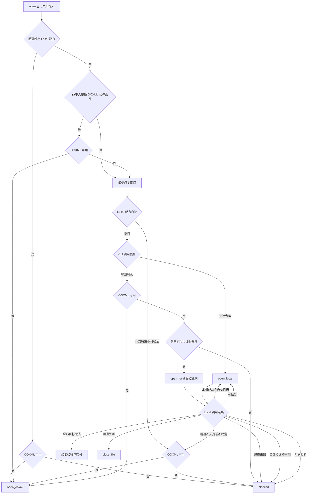

# Canvas 模式下的读取与编辑

用于读取、总结、问答或编辑宿主当前 Canvas Word。按 `SKILL.md` 确认该目标的 `<system-reminder>` 提供 `type=word`、`path`、`token`、`file_status`，并要求通过 token 使用 CLI 后进入本 workflow；`selection` 可选。宿主要求直接读写 `type=lark_doc` 的 `file_path` 时走 `local-docx-editing.md`。本页的 Local 指 Canvas CLI，不指本地打开的 DOCX 流程。

> 使用前须完整读取本页；未见末行「全文完」时，调整 offset 继续读取至该标记。

## 使用方式与文件分工

先在本页完成路由，只读取被选分支。以下 workflow 分别负责路由、执行与恢复：

| 文件 | 唯一职责 | 不负责 |
|---|---|---|
| 本页 | 状态门禁、引擎选择、读取入口、最终交付 | 具体写入语法和失败重试 |
| [`canvas-doc-editing.md`](canvas-doc-editing.md) | 用最少必要读取判断 Local 是否适用及调用预算；执行已选中的 `open_local` | 入口前两层路由、切换 OOXML 或文件分支 |
| [`canvas-doc-recovery.md`](canvas-doc-recovery.md) | 确认写入终态、使用固定恢复预算、返回标准结果 | 选择下一条路由 |
| [`canvas-doc-ooxml.md`](canvas-doc-ooxml.md) | 执行已选中的 `open_ooxml` | 重新评估 Local 或转文件分支 |

命令参数查 `references/cli`，可写语法查 `references/xml`；workflow 不重复这些契约。只读投影不证明可写，dry-run 不证明落盘，XML 回读不证明视觉效果。规则冲突或实际返回违背契约时停止写入并保留证据。

各分支的执行顺序：

- **只读**：Fetch → 回答。
- **Local**：任务策略 → 最新 baseline → 能力检查 → 调用预算 → 分组更新 → 屏障回读。
- **OOXML**：任务策略或高预算切换 → 取回 → baseline → 增量编辑 → 完整检查 → 提交。
- **文件分支**：同目录备份 → 原路径编辑 → 完整检查。

只有计划内目标及必要验收全部通过，才能报告“已完成”。

## 用户可见表达

用户可见的进度、工具调用说明和最终回复只描述内容处理、检查结果与实际限制，不复述内部路由、命令、脚本或错误码。提交受理称“修改已提交”，回读确认后才称“修改已应用”；audit 通过只核销其实际覆盖项。用户明确要求技术细节时可解释必要名词，仍不暴露 token 或临时路径。格式、保存及交付措辞统一遵循[交付披露](#交付披露)，文件分支按其路径例外处理。

## Canvas 上下文

宿主会在 `<system-reminder>` 中注入 Canvas 上下文；本 workflow 依赖这些字段判断走哪条分支：

| 字段 | 含义与用法 |
|---|---|
| `path` | 当前打开文件的真实本地路径。正常 `open` 链路仅用于识别和用户要求的文件级操作，不得用它读写活动内容或代替 `token`。只读任务在恢复模块确认全部 Canvas CLI 经一次环境修复仍不可用时，可读取磁盘已保存版本并明确未保存改动不可见；不得据此编辑原文件。OOXML 编辑路径只能取自 `+ooxml-fetch`；明确 `close` 时按[关闭文件分支](#关闭文件分支)使用 |
| `type` | 文件类型；Canvas 打开的本地 Word 标识为 `word`。该值须结合当前目标的整组字段及 `<information>` 操作要求判断，不能单独据此推断在线文档或本地路径操作 |
| `token` | 当前底层产物的不透明唯一标识，作为本 workflow 中本地 CLI 的 `--doc`；不校验或推断其长度、格式和资源类型。**禁止**把 `token` 拼接成 URL 呈现给用户 |
| `file_status` | 文件状态，取值为 `open` 或 `close`；`open` 时进入本页路由门禁，编辑任务在全部 Canvas CLI 经一次环境修复仍不可用时停止并要求用户先保存、关闭文件；`close` 时直接走[关闭文件分支](#关闭文件分支) |
| `selection` | 用户当前选中的位置；用于定位消歧，**不代替 fetch** |

> ⚠️ `selection` 通常包含 `selected_text` 及 `selected_block.block_range.start/end`。仅在用户指令指向选区或未明确其他目标时，用 `selected_text` 辅助定位；残留或无关选区不覆盖用户明确范围，但写入仍必须先 fetch 得到最新 block ID 和完整 XML；`selected_text` 超过 4000 字符会被截断，此时不得据此推断"整段就是这些"，必须 fetch 确认完整内容。
>
> ⚠️ `block_range.start/end` 只是选区提示，不能直接当 `--start-block-id` / `--end-block-id` 用：选区落在单元格、列表项、页眉页脚里时它不是正文顶层块，传给 `range` / `section` 会返回 404（见 [`../cli/canvas-doc-fetch.md`](../cli/canvas-doc-fetch.md)）。这种情况改用所属顶层块：`<td>` 内优先复用已知顶层 `<table>` ID；未知时读取所属章节或必要正文范围，按选中文字与相邻内容定位表格。`outline` 只列标题，可帮助缩小章节范围，不能直接返回表格。页眉页脚改走 `<layout>` / `<layout-break>`。
>
> ⚠️ **文件可能被实时协同更新，写前须有本轮最新完整目标**：同一份响应可同时完成定位、规划和本次写前检查，不为每个步骤重复 fetch；响应完整落盘后可在本地多次筛选。前序写入通常使旧快照失效；只有 [`canvas-doc-editing.md` 的延迟回读组](canvas-doc-editing.md#批量修改与验收屏障) 能在满足独立性与并发保护条件时沿用组级基线到验收屏障。协同变化、冲突、跨轮或保护条件不成立时立即重新 fetch，不依据旧快照继续写。

### 路由总表（唯一判定入口）

- 同一 `token` 的 `path`、`type`、`file_status` 可沿用该文件上一次明确值，新声明覆盖旧值；`selection` 不跨轮默认沿用。新 `token` 的缺失字段视为未知，不继承其他文件状态。
- 状态未知时只读识别或澄清，不写入；存在终态未知写入时直接 `blocked`。
- `file_status=close` 或 CLI 明确声明关闭时进入 `close_file`；只有 `open` 且无未知写入才继续。
- 本页是唯一决策入口。其他 workflow 只返回事实或执行已选分支。权限/确认拒绝、无效 token 和其他明确阻断优先于引擎兜底；文件已关闭与未知写入也须先过上述状态门禁。

为防止反复探测，本轮维护一个路由记录：`strategy`、`document_scale`、`local_capability`、`local_budget`、`ooxml_fetch`、`active_route`、`write_state`。`local_budget` 记录 CLI 写请求下界、可证明的总请求上限、是否有无界循环及判定依据。`ooxml_fetch` 同时保存状态（unknown/ready/unavailable）、失败分类、返回路径与原始信封；成功结果在同一有效获取周期内复用。候选取回后若又发生 Local 写入或已知协同变化，该候选失效；实际切入 OOXML 时结束旧周期并重新取回，不提交旧快照覆盖新修改。同一事实一旦确定便复用；文件状态、CLI 可执行文件、目标结构/baseline 或用户目标发生实质变化时，只重验受影响事实，不从入口整套重跑。

首次 `+ooxml-fetch` 前先完整读取[命令契约](../cli/canvas-doc-ooxml.md)。准备进入 OOXML 编辑时，先完成与活动内容无关的附件读取、写作指南、素材和依赖准备，取回前简短提示用户“本轮修改完成前请暂勿同时编辑文档”，不等待确认，再取回候选。这次取回同时作为可用性探测，不提前取回后再做无关长耗时工作。只读降级不需要编辑准备或提示。获取失败必须经 recovery 分类，不能只记为 unavailable 后继续：明确关闭且无未知写入转文件分支；权限/确认拒绝、无效 token 或 `local_blocked` 停止；其余非阻断性失败按下图的“OOXML 不可用”分支处理；全部通道不可用仍须满足 recovery 的双入口证据要求。ready 只代表取回成功，不代表提交权限或任务完成。



计划内自动目录是独立阶段，不进入上图正文分流。纯读取、总结和问答先过状态门禁：`open` 进入[读取流程](#读取流程)，明确关闭进入文件分支；不做编辑能力与预算门禁。Local 只读请求的恢复预算耗尽且无未知写入时，可取回一次 OOXML 只读快照并用 `scripts/read.py` 解析；权限/确认拒绝、无效 token 或其他 `local_blocked` 不走此降级。取回成功后仅回答，不加载编辑 workflow、不修改或提交。取回也失败时，仅 recovery 明确确认全部 CLI 不可用才允许从 `path` 只读磁盘已保存版本，并明确未保存改动不可见；不得进入文件编辑或后处理，其余情况报告读取失败。

**单向约束**：正文只允许 `入口 → open_local → open_ooxml → 终态`，可跳过中间节点但不得反向。同一路由只选中一次，路由内修复使用既定预算且不重新选路；`ooxml_fetch` 每周期只取回一份候选；失败重试仅用 recovery 的固定预算，结果和路径一起复用。进入 `open_ooxml` 后不再执行正文 `+local-update`；进入 `close_file` 后不再调用 Canvas 命令；`blocked` 是本轮终态。唯一例外是正文完成后的独立目录阶段。

#### 第一层：明确的 Local 能力边界

先只看用户目标和已知命令契约，不 Fetch、不试写。目标明确要求 Local CLI 没有合法表达的操作时，直接优先使用 OOXML 并探测一次 `+ooxml-fetch`，例如接受全部/拒绝全部修订、按条件接受或拒绝修订、清除修订标记，以及其他必须直接修改 OOXML 原生结构且已知没有等价 Local command 的操作。

只有契约明确无能力才能在本层排除 CLI；“命令不熟悉”、目标复杂、文档大或预计调用多都不等于能力不足。OOXML 不可用且 Local 明确不支持时进入 `blocked`；若 recovery 已确认全部 Canvas CLI 不可用，则停止编辑并要求用户先保存、关闭文件。不得用不受支持的 CLI 写法试错。

#### 第二层：大规模编辑的 OOXML 优先条件

未超出 Local 能力时，继续优先考虑 CLI；仅当用户目标或现有可靠上下文已经足以证明下列任一条件，才优先使用 OOXML：

1. 生成、重写或重排整份文档，计划需要整体重建；
2. 对整篇或完整章节中的大量独立 carrier 重复执行删除、替换、转换或格式处理，且没有能覆盖该目标的 Local 批量/领域命令；
3. 已知 CLI 写请求下界超过 40、最低总请求超过 60，或目标持续增长而无法给出有限上限；大文档的重复编辑在写请求下界超过 20 时即可命中。

本层不为判断规模额外读取。证据不足时不得猜测为大规模，进入第三层；已知小文档也只有达到上述请求下界才提前走 OOXML。`+ooxml-fetch` 成功则选 `open_ooxml`；不可用时复用该结果，继续第三层评估 Local 兜底。

文档规模只使用任务本来已有的可靠证据，不为取得页数额外导出 PDF：已知页数不超过 10 且可写 block 不超过 200 时记为小文档；页数超过 20 或可写 block 超过 500 时记为大文档；其余及缺失数据记为中等/未知。两个已知指标冲突时取较大规模。大文档中的少量有界修改仍继续评估 CLI。

#### 第三层：最少必要读取、CLI 能力与调用预算

未命中前两层，或第二层优先使用 OOXML 但获取非阻断性失败时，才读取 [`canvas-doc-editing.md`](canvas-doc-editing.md)。用最少必要读取同时完成能力与预算判断：已有上下文足够时不额外 Fetch；否则选择 `outline`、已知 `section/range + full` 或当前选区所属顶层范围。响应完整落盘后只在本地筛选，不先用一次全文 Fetch 测大小、再重复 Fetch 保存正文。

**能力判断按操作类型和必要对象形状归并**。同类的 100 个段落格式修改只确认一次该形状的合法表达、身份、保真和验收条件，不逐项验证相同契约；五项全部成立才记为 `local_supported`：

1. 当前构建明确暴露所需 Fetch scope、Update command 和参数；
2. `+local-fetch` 能返回目标所需的完整可写结构、合法身份或稳定锚点；
3. CLI/XML 专项明确给出目标内容、结构和属性的合法表达；
4. 最小更新能够保留 baseline 的所有非目标内容、结构、格式和 owner/story 关系；
5. 写后存在足以核销目标与保留项的结构或领域回读。

`local_unsupported` / `local_unverifiable` 直接复用已有 OOXML 探测结果，未知时只探测一次。普通超时、5xx、调用错误、权限拒绝或定位冲突不属于能力不足；PDF 不可用只影响视觉验收。

能力成立后立即计算调用预算，不先形成完整 ID 清单。预算只需证明“仍在上限内”或“已经超过上限”，不要求精确总数；下界超限即停止枚举并返回 `local_budget_high`。父容器不属于合法原子写入目标时，不能假设整体替换父容器会合并多个独立 carrier。

| 目标形状 | CLI 写请求下界 |
|---|---|
| 多个独立段落、标题或列表项的格式/结构修改 | 每个 carrier 至少 1 次 `block_replace`；数到超过阈值即可停止 |
| 多个独立 block 删除 | 每个 block 至少 1 次 `block_delete` |
| 多组不同 pattern/content 的纯文本替换 | 每组至少 1 次 `str_replace`；没有 `replace_all` |
| 同一真实锚点后的相邻新增内容 | 能组成一个合法最终载荷时按 1 次，否则按独立锚点计数 |
| 表格、样式、图表数据、目录、水印等领域操作 | 契约明确支持批量时按真实请求数；不明确时不假定可批量 |

```text
estimated_total_calls = 后续读取 + 更新提交 + 屏障回读 + 领域/PDF 验收 + 2 次恢复预留
```

- 小型或中等/未知文档：只有能够证明合并后的写请求上限不超过 40、总请求上限不超过 60，且每个循环都有确定上限，才记为 `local_budget_ok`。
- 大文档的重复编辑：写请求上限不超过 20，且总请求和循环仍满足上项要求，才记为 `local_budget_ok`；少量非重复编辑仍使用 40/60 上限。
- 超过适用上限、无法给出有限上限，或只能按动态增长的目标逐项调用时，记为 `local_budget_high`。
- `local_supported + local_budget_ok` 选择 `open_local`；能力不足或预算过高时探测一次 OOXML，可用则选择 `open_ooxml`。
- OOXML 非阻断性不可用但 `local_supported`，且剩余目标与请求数具有可证明的有限上限时，选择 `open_local` 作为受控兜底，记录 `budget_override=fallback`，严格串行并在首个非干净结果时停止。无法给出有限上限时停止并说明范围限制，不能用预算豁免放行无界循环。

预算判断发生在第一笔正文写入前。执行中只有目标范围、最低调用数或恢复消耗发生实质变化时才更新剩余预算；若更新后成为 `local_budget_high`，先停止后续写入并确认现有写入终态，再按上述 OOXML 获取分类决定切换、有界 Local 兜底或停止。改名、换脚本、换命令或拆分批次不能重置已消耗预算。

#### 第四层：CLI 调用与失败判定

下表只处理正文 Local 的能力探测和执行结果。只读任务使用上文只读降级规则；OOXML 提交结果交回 `canvas-doc-ooxml.md`，不重选引擎；独立目录阶段使用本页下方的目录出口。

能力探测失败、Local 执行失败或更新出现 warning / `partial_success` 时，由 [`canvas-doc-recovery.md`](canvas-doc-recovery.md#标准化运行结果) 在固定预算内返回一个标准结果；入口只按下表消费，不重新解释错误：

| recovery 结果 | 本层处理 |
|---|---|
| `local_succeeded` | 复用 recovery 已完成的证据；能力探测恢复成功则继续完成能力与预算门禁，编辑成功且有剩余目标则继续 `open_local`，全部目标核销后仅完成尚未完成的计划内目录、必要视觉验收与交付，不重发已完成目标 |
| `local_retryable` | 在原失败阶段使用剩余预算修正或重试；能力探测尚未通过时只继续探测，不据此进入写入 |
| `local_unsupported_runtime` | 作为 `local_unsupported`；复用已有 OOXML 探测结果，未知时只探测一次 |
| `local_unstable` | 复用已有 OOXML 探测结果，未知时只探测一次；可用则转 `open_ooxml`，不可用则 `blocked` |
| `unknown_write` | 进入 `blocked`；只跟踪原任务和读回确认，禁止新增写入、OOXML 与文件分支 |
| `explicit_close` | 无终态未知写入时进入 `close_file` |
| `all_canvas_cli_unavailable` | 进入 `blocked`；编辑任务要求用户先保存、关闭文件，只读任务可按上文读取磁盘已保存版本 |
| `local_blocked` | 进入 `blocked`；若写入终态已知但验收不足，保留已应用状态与具体验证缺口，不误报为未写入或已验收 |

写请求超时、5xx、响应缺失、非法 JSON 或缺字段必须先确认终态。参数/XML 错误、block ID 失效和定位冲突不直接转 OOXML。已验收目标不回滚；切换后 OOXML 只处理剩余目标和恢复已知副作用所需的修改。

#### 最终路由与执行证据

| 路由 | 最终进入条件 | 内容读取 / 编辑 | 自动目录 | 渲染验收 |
|---|---|---|---|---|
| `open_local` | `local_supported + local_budget_ok`；或 OOXML 非阻断性不可用、Local 能力完整且执行有界，带 `budget_override=fallback` | `+local-fetch` / `+local-update` | 独立目录阶段使用 `table_of_contents_update` | XML 回读；命中视觉条件时宿主 Fetch `pdf` |
| `open_ooxml` | 明确超出 Local 能力、命中大规模编辑条件、`local_budget_high`，或 Local 能力门禁/运行结果允许切换，且 OOXML 可用 | 只读任务解析取回文件；编辑任务取回、审计、原地修改并提交 | 提交并确认同步后进入独立目录阶段 | 提交前完整检查；同步后按需宿主 Fetch `pdf` |
| `close_file` | `file_status=close` 或 CLI 明确声明文件已关闭，且无终态未知写入 | 从 `path` 读取；编辑前同目录备份，原地编辑 `path` | `catalogue.py` / `+word-post-process` 文件后处理 | audit 与结构回读；按需 LibreOffice 本地渲染 |
| `blocked` | 状态未知、写入终态未知、能力与可用兜底均不足、权限/确认拒绝、定位不唯一、路径不可安全读写，或安全恢复耗尽 | 禁止新增写入；只做消除未知所需的查询 | 不执行或保留已完成正文、单独标记目录未完成 | 不把缺失证据记为通过 |

固定顺序是：**状态门禁 → 明确能力边界 → 大规模 OOXML 条件 → 最少必要读取并判断 CLI 能力与预算 → CLI 运行结果 → 最终路由**。只有明确超出能力或命中大规模条件才在读取门禁前优先 OOXML；其余编辑均先确认 CLI。可恢复的中间探测与安全切换留在执行记录中；最终按实际目标和验收结果报告，未完成的目录、同步或视觉检查须明确披露。

- 本轮选中 `open_ooxml` 后，正文等剩余编辑统一走 OOXML；失败不回退 Local。只有提交并确认同步后，计划内目录才进入独立阶段。新用户指令才重新路由。
- **禁止把本地文件上传至在线**：Canvas 场景只使用上述本地 CLI、OOXML 或文件分支，不得为了绕过失败把 `path` 上传成在线云文档。
- **文件级操作走 shell，目标是真实 `path`**：复制、移动、重命名文件不属于本 workflow 的 CLI 能力；不得把 `+ooxml-fetch` 返回的临时产物当作文件级交付目标。
- **不向用户暴露底层原理**：默认不解释工作目录、底层产物或 token 映射；用户明确要求时可以说明，但不得把 `token` 拼成 URL。

### 目录任务与提交收尾

**打开态以 Canvas CLI 和宿主渲染结果为准**：目录通过 `+local-fetch` 读取当前身份、通过 `+local-update` 的目录领域命令写入；实际条目、分页和显示页码使用操作后的宿主页面证据，必要时通过 Fetch `pdf` 补查。OOXML 候选用于正文编辑与结构保留，不能以候选缓存、磁盘已保存版本或本地渲染结果代替当前 Canvas 的目录结果。此规则不改变正文引擎路由、自动维护、同步门禁或视觉验收范围。

目录是否需要维护按本轮编辑影响和用户要求判断：标题、编号、分页等修改影响既有目录时，将必要更新纳入计划；无影响且用户未要求目录操作时不刷新，未要求新增时不自行新增。Local 与 OOXML 的维护范围和必要验收分别遵循对应编辑 workflow。

- `open_local`：先完成正文与布局，再使用 `table_of_contents_update` 处理计划内目录。
- `open_ooxml`：候选中保留既有目录结构与缓存；提交后按 [OOXML 同步门禁](canvas-doc-ooxml.md#第-5-步--提交与校验) 确认状态，再处理计划内目录。明确确认生效、动态结果、后续依赖和必要视觉验收仍可触发同步，不限于用户明确提到目录。
- `close_file`：按文件流程编辑；目录新增、配置或删除先在 TARGET 中完成，再执行 `catalogue.py` 更新已有 TOC 并验收最终文件。

打开态目录命令后，先区分写入终态与验收结果：命令失败、warning 或终态未知先走 recovery；已确认写入且条目或页码证据不足时，优先复用有效页面证据，再用 Fetch `pdf` 补查。无法恢复写入时，PDF 仅按用户目标需要提供页码诊断，不计为目录更新成功。PDF 不替代目录写入，也不等同于 `catalogue.py`；不手工写页码缓存或自动改成静态目录。目录验收不替代正文视觉验收；失败、修正及多目录最终分页验收统一按 [`canvas-doc-toc.md`](../xml/canvas-doc-toc.md) 执行。

### 关闭文件分支

本分支只接受入口选出的 `close_file`；进入后不再调用 `+local-*` 或 `+ooxml-*`。打开态编辑不得进入本分支：所有 Canvas CLI 不可用时停止并要求用户先保存、关闭文件，不能基于磁盘快照原地写入。

- **读取/问答**：用 `scripts/read.py` 只读 `<path>`。
- **编辑前**：确认 `<path>` 仍是同一份可读写文件，记录 size/mtime/hash；在同目录创建时间戳备份并核对哈希。失败即停止。
- **编辑**：备份为只读 SOURCE，原 `<path>` 为唯一 TARGET，按 [`docx-editing.md`](docx-editing.md) 的路径策略例外原地增量编辑。修复也在同一 TARGET 增量完成；不执行其默认的副本创建、重新生成和末尾整份写回。若本轮已有已验收 Canvas 写入，必须先确认磁盘版本已包含，否则停止文件写入，避免覆盖或遗漏本轮改动。
- **并发保护**：每次保存前核对磁盘文件仍匹配本轮最近一次读取或自己成功保存后的 size/mtime/hash；只在一致时写入，自己的每次成功保存后推进该基线。首次写入前发生外部变化，只允许重新备份、读取和规划一次；再次漂移则停止。本轮已经写入后发现外部变化时立即停止，不能用旧内存对象或备份覆盖。这是尽力检测，不是宿主写入锁；明确要求同时编辑原子隔离的任务不得进入此分支。
- **目录与验收**：目录使用 `catalogue.py` / `+word-post-process`；先 audit 与结构回读，命中视觉条件时只探测一次 LibreOffice 并查看受影响页及相邻页。
- **交付**：说明原路径和最终备份路径；渲染不可用只披露实际未验证范围。宿主要求编辑后显式交付时，仍使用交付工具交付本分支已验收的原路径文件；不能套用本地打开流程的“不交付”规则。

不得把此前 CLI XML、OOXML 候选或历史上下文覆盖到 `<path>`，也不得把 token 拼成 URL。

## 读取流程

1. 本节只读取当前 Canvas 的活动内容，包括将其用作其他产物的材料；其他附件、路径和新产物另按 `SKILL.md` 路由。当前文件须已通过状态门禁；首次调用前按 [`canvas-doc-fetch.md` 的读取导航](../cli/canvas-doc-fetch.md#按需读取)完整读取公共契约和本次所需章节。当前 Canvas 的只读任务、未提前分流的编辑，以及优先 OOXML 但必须评估 Local 备选的任务使用本节。
2. 按用户目标选择最小 scope 和 detail，并使用本轮 `<token>` 作为 `--doc`。正文编辑（包括润色、纠错、加粗修改处）直接选择 `--detail full`，同时取得文字、ID 和格式；`--scope full` 不代表包含格式。已知合法顶层锚点时读 `range/section + full`；需要通读且篇幅可控时读 `full + full`，大文档先用 `outline` 定位再分段读 `full`，不固定走 `outline → with-ids → full`。定位以用户指令为准；未明确指定目标时，优先使用 `<selection>` 辅助定位。
3. 执行 `docs +local-fetch`：退出码为 0 且 `ok == true` 后才使用 content，否则按 [失败处理](canvas-doc-recovery.md#失败处理) 分档。`requested-*` 只是请求回显，不能证明覆盖完整；核对实际目标、边界、必要子对象及 tips。编辑读取不随意设置 `--max-depth`，避免深层标题及内容被裁掉。只读任务只基于本次完整返回作答；存在缺失或降级时说明影响，不用历史内容补全。
4. **按页读取与页面边界**：仅在用户意图依赖具体页面或页面边界时使用。已知页码时直接用 `page + full` 读取该页；未指定页码但提供或划定内容、对象时，对待查页批量发起相互独立的单页 `page + full` 请求，每个请求的起止页相同，并在各自响应中匹配目标以确定页码；不得用一个跨页请求推断页归属。page 返回的首末 block 只是与该页相交的边缘 carrier，不能单独证明页面边界；同一目标 block 出现在多个单页响应时，转第 5 点用 PDF 确定选区所在页及块内页面边界。
> **同版本页面证据**：组合相邻页或多个单页响应定位边界时，核对各自 `data.document.revision_id` 一致；调用相邻或同时发起不代表属于同一分页版本。版本不一致时不比较首末 block；只补读不匹配的必要页，最多 2 轮且共享 recovery 的 20 秒读取截止时间，持续变化则停止页面定位。PDF 仅在没有中间写入或已知协同变化时与该组 XML 配合；PDF 回执的 revision 是导出完成后建立的 checkpoint，不能仅凭数字相等证明其所有页面与此前 XML 原子一致，出现矛盾须重新定位。
>
> **页面边界证据门禁**：“本页”以选中文字或对象实际渲染所在页为准，不能按其 carrier 覆盖的全部页面推断；选区自身跨页且用户未指明时先澄清。有相邻页时，页尾操作的最新基线必须分别包含目标页和下一页，页首操作必须分别包含上一页和目标页，未读相邻页前禁止 update。第一页页首或已确认末页的页尾以最新正文起止结构和目标单页响应为边界证据，不请求第 0 页或超出末页的页码；末页须由最新完整 PDF 页数及末页内容确认，不能把空响应、错误或最后一个 block 猜作末页。单页文档两端分别使用同样规则，必要时查看 PDF 消歧。同一边缘 block ID 出现在两页表示该 block 跨页，转第 5 点确定块内页面边界；只在相邻页未出现该 ID 时，才可把该 block 边界视为页面边界。
5. **PDF 补充读取**：任务依赖实际渲染且 page/XML 无法确定分页边界、遮挡、溢出、浮动对象位置等视觉事实时，使用 `--scope pdf` 导出并实际查看页面。默认覆盖目标页及相邻页；分页影响向后传播时继续扩大，全局任务或无法可靠界定范围时覆盖全篇。跨页 block 必须先据此确定块内页面边界，并把边界映射到最新 `full` XML 中可拆分的文本、行内对象或子节点位置；消歧完成前不得执行任何 update，也不得将整个 block 的前后边界作为替代写入位置。无法从 PDF 与 XML 得到唯一块内位置时停止写入并澄清，不以段前或段后插入降级。PDF 只补充视觉事实，不能用于推断 block ID 或替代结构与格式读取。

宿主 PDF 导出失败时按 [恢复出口](canvas-doc-recovery.md#4-宿主-pdf-失败) 处理；缺少的页面证据仍是待验收项，不以本地渲染结果代替。

## 编辑路由

未提前分流的编辑读取 [`canvas-doc-editing.md`](canvas-doc-editing.md) 完成能力与调用预算门禁；第二层优先 OOXML 但获取非阻断性失败时，也读取它评估 Local 兜底。选中 `open_local` 才执行写入；实际失败、写入终态未知或更新出现 warning / `partial_success` 时读取 [`canvas-doc-recovery.md`](canvas-doc-recovery.md)；选中 `open_ooxml` 才读取 [`canvas-doc-ooxml.md`](canvas-doc-ooxml.md)。计划含目录时，在规划正文与分页修改时读取 [`canvas-doc-toc.md`](../xml/canvas-doc-toc.md)，先确定目录位置与必要分页边界，正文完成后再统一执行目录命令与验收。目录恢复结果只在该阶段消费：成功则验收；可重试则使用剩余预算；能力不足或预算耗尽则停止目录并披露未完成；未知写入只读确认。目录阶段不重进正文引擎选择、不切 OOXML 或文件分支，失败后保留已完成正文。

## 交付披露

以下约束适用于 `open` 状态下从开始执行到最终交付的**所有用户可见文字**，包括进度说明和工具调用前说明；明确 `close` 后就地修改原文件及备份的交付按[关闭文件分支](#关闭文件分支)单独说明，此处规则不适用（可正常提及".docx / 原文件路径 / 备份路径"）。

收尾时在原 `edit_plan` 中分别核销内容/格式目标、计划内目录写入及条目/页码验收、门禁要求的同步/视觉检查、宿主要求的显式交付，并保留各项实际证据和未完成原因；不另建清单，不新增同步或视觉检查范围。命令成功、audit 通过、Todo 标记完成或交付成功，都不能代替其他项目的验收。用户要求整份模板统一格式时，局部补文的文字回读只能核销补文，不能据此宣称整份格式已验收。仍有失败或未验证项时可以交付已完成结果，但必须说明缺口，不能将全任务标记为完成。

- 不提示「刷新 / 重新打开 / 重新加载」：runtime 会自动同步到用户窗口。
- 不说「已保存 / 文件已保存」：写回文件不等于宿主已保存。
- 编辑任务中宿主上下文明确要求交付工具且工具可用时，按真实参数交付本轮实际目标，检查交付结果后再回复，不以「已同步」或计划中写了“交付”替代实际调用；不得交付旧 SOURCE 或临时候选。要求交付但工具缺失或调用失败时记录交付未完成；未提供交付规则时直接说明结果，不猜工具名、文件路径或 token 链接。
- 最终回复用户时不出现 "Word / .docx / 文档格式" 等字眼：暴露底层格式或宿主软件名会与用户预期不符。
- 需披露渲染降级、字段未刷新等硬限制时用中性表述（如"当前版面尚未完成检查"、"目录页码尚未核实"）；已经确认不符时明确说明不符，不能弱化成“可能”。仍避免出现 Word / .docx / 文档格式字样。

交付说明应列明实际修改范围、必要关联修改和未验证限制（含渲染降级），不得只写「已检查，无问题」。内部必须区分读取兼容提示、提交警告和校验失败；用户可见回复只说明它们对内容、格式、版面或交付状态的实际影响，不复述原始字段、错误码、脚本名或子命令名。计划内差异按 [OOXML 验收](canvas-doc-ooxml.md#第-4-步--验收) 精确声明后重跑，以最新退出码和报告状态为准，不能把旧的非零结果口头改判为通过。读取兼容提示不等同于提交警告或内容被删除，只有它妨碍目标区域验证时才构成阻断。

===== 全文完 =====
