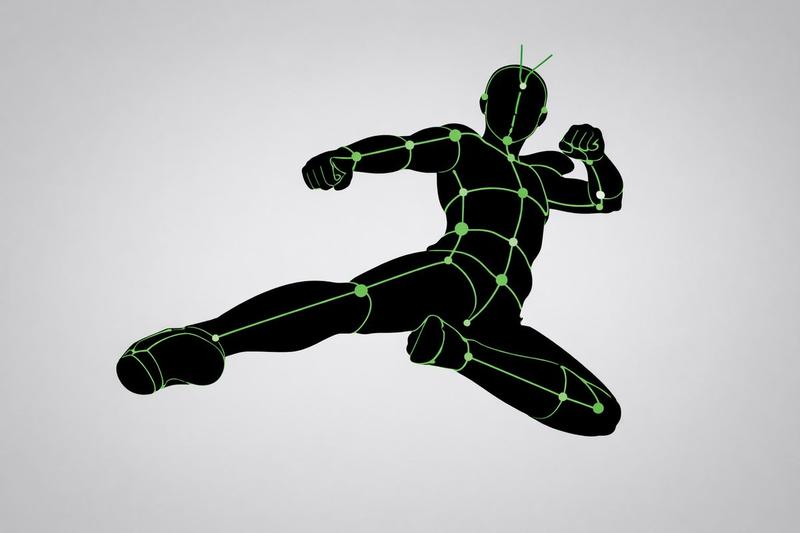
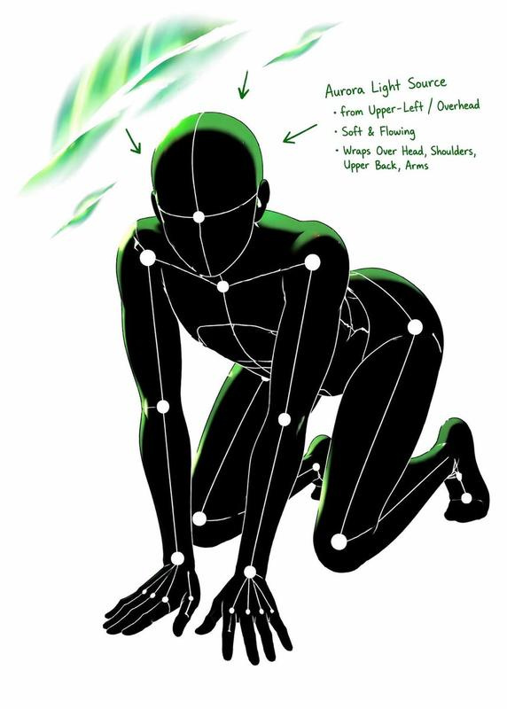
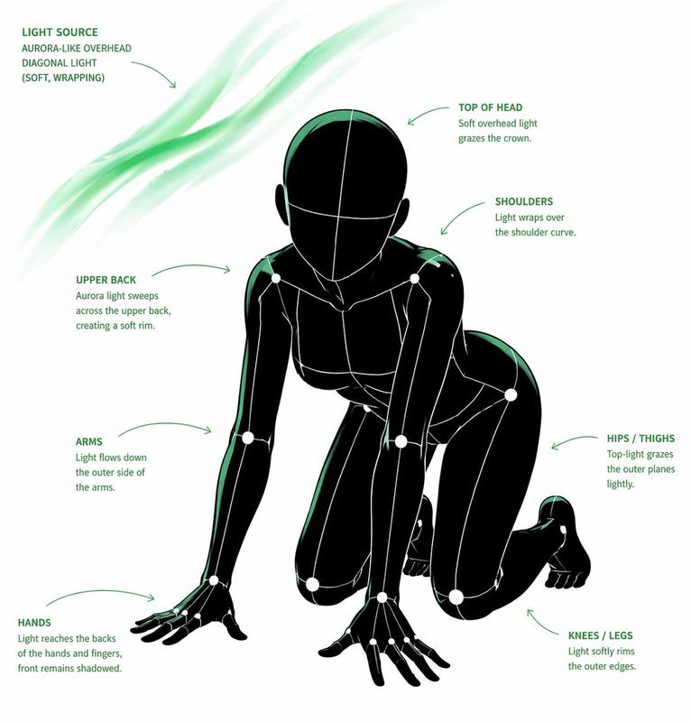

## 例 78：图像生成案例图

**来源：** [@WOZ1Tx2JZ3kCeBj](https://x.com/WOZ1Tx2JZ3kCeBj)




```text
[CORE TASK]
Transform the provided input image into a pose-and-light analysis sheet.

This is NOT a finished character illustration.
This is NOT a clothing sheet.
This is NOT a beauty-preserving redraw.

This is a white-line rough mannequin conversion.

[PRIMARY GOAL]
Extract and visualize only:
- pose structure
- body balance
- camera angle
- body line flow
- inferred light source placement
- illuminated areas and light intensity

[INPUT ROLE]
Use the provided image as the strict anchor for:
- pose
- camera angle
- body tilt
- weight distribution
- approximate lighting situation

Do NOT preserve:
- face rendering
- hairstyle rendering
- clothing detail
- accessories
- weapon detail
- background architecture
- character identity
- emotional expression

[FIGURE CONVERSION]
single rough mannequin-like human figure
white body contour lines
white internal construction lines
simple mannequin head
no face
no eyes
no mouth
no eyelashes
no personality
no individual identity

human figure should look like:
- rough pose mannequin
- anatomy proxy
- line-based body guide
- structural sketch
- white-line rough dummy

keep:
- pose readability
- silhouette flow
- head tilt
- torso direction
- pelvis direction
- limb placement

[BACKGROUND]
pure black background
negative-style dark field
no scenery
no props
no architecture
no environmental storytelling

[LINE STYLE]
rough white line drawing
clean but sketch-like
construction-line feeling
anatomy guide lines visible
joint flow visible
body contour emphasized
no polished illustration finish

[LIGHT ESTIMATION]
predict the likely light source positions from the input image
visualize the light sources and illuminated areas using green glow only

use green light intensity with variation:
- strongest green where the light directly hits
- medium green for wrap light
- soft green for reflected or fading light

mark the estimated light sources with labels and arrows such as:
- Main Light
- Rim Light
- Fill Light
- Floor Bounce
- Back Light
only if appropriate

IMPORTANT:
do not invent random lights
infer lighting from the original input image
if the lighting is ambiguous, keep the annotations simple and plausible

[GREEN LIGHT VISUALIZATION]
show green glow on:
- head / skull plane
- neck
- shoulders
- chest plane
- ribcage direction
- pelvis edge
- thigh planes
- knee contact points
- floor contact bounce if applicable

use green light not as decoration,
but as lighting analysis information

[POSE PRIORITY]
1. preserve pose structure
2. preserve camera angle
3. preserve body balance
4. preserve head-torso relationship
5. visualize likely light direction
6. show illuminated areas with readable green intensity variation

[NEGATIVE]
finished person,
cute girl,
detailed face,
hair rendering,
clothing rendering,
weapon emphasis,
beautiful anatomy
```

---

---

## 例 79：图像生成案例图

**来源：** [@WOZ1Tx2JZ3kCeBj](https://x.com/WOZ1Tx2JZ3kCeBj)




```text
[CORE TASK]
Transform the provided input image into a pose-and-light analysis sheet.

This is NOT a finished character illustration.
This is NOT a clothing sheet.
This is NOT a beauty-preserving redraw.

This is a white-line rough mannequin conversion.

[PRIMARY GOAL]
Extract and visualize only:
- pose structure
- body balance
- camera angle
- body line flow
- inferred light source placement
- illuminated areas and light intensity

[INPUT ROLE]
Use the provided image as the strict anchor for:
- pose
- camera angle
- body tilt
- weight distribution
- approximate lighting situation

Do NOT preserve:
- face rendering
- hairstyle rendering
- clothing detail
- accessories
- weapon detail
- background architecture
- character identity
- emotional expression

[FIGURE CONVERSION]
single rough mannequin-like human figure
white body contour lines
white internal construction lines
simple mannequin head
no face
no eyes
no mouth
no eyelashes
no personality
no individual identity

human figure should look like:
- rough pose mannequin
- anatomy proxy
- line-based body guide
- structural sketch
- white-line rough dummy

keep:
- pose readability
- silhouette flow
- head tilt
- torso direction
- pelvis direction
- limb placement

[BACKGROUND]
pure black background
negative-style dark field
no scenery
no props
no architecture
no environmental storytelling

[LINE STYLE]
rough white line drawing
clean but sketch-like
construction-line feeling
anatomy guide lines visible
joint flow visible
body contour emphasized
no polished illustration finish

[LIGHT ESTIMATION]
predict the likely light source positions from the input image
visualize the light sources and illuminated areas using green glow only

use green light intensity with variation:
- strongest green where the light directly hits
- medium green for wrap light
- soft green for reflected or fading light

mark the estimated light sources with labels and arrows such as:
- Main Light
- Rim Light
- Fill Light
- Floor Bounce
- Back Light
only if appropriate

IMPORTANT:
do not invent random lights
infer lighting from the original input image
if the lighting is ambiguous, keep the annotations simple and plausible

[GREEN LIGHT VISUALIZATION]
show green glow on:
- head / skull plane
- neck
- shoulders
- chest plane
- ribcage direction
- pelvis edge
- thigh planes
- knee contact points
- floor contact bounce if applicable

use green light not as decoration,
but as lighting analysis information

[POSE PRIORITY]
1. preserve pose structure
2. preserve camera angle
3. preserve body balance
4. preserve head-torso relationship
5. visualize likely light direction
6. show illuminated areas with readable green intensity variation

[NEGATIVE]
finished person,
cute girl,
detailed face,
hair rendering,
clothing rendering,
weapon emphasis,
beautiful anatomy
```

---

---

## 例 80：图像生成案例图

**来源：** [@WOZ1Tx2JZ3kCeBj](https://x.com/WOZ1Tx2JZ3kCeBj)




```text
[CORE TASK]
Transform the provided input image into a pose-and-light analysis sheet.

This is NOT a finished character illustration.
This is NOT a clothing sheet.
This is NOT a beauty-preserving redraw.

This is a white-line rough mannequin conversion.

[PRIMARY GOAL]
Extract and visualize only:
- pose structure
- body balance
- camera angle
- body line flow
- inferred light source placement
- illuminated areas and light intensity

[INPUT ROLE]
Use the provided image as the strict anchor for:
- pose
- camera angle
- body tilt
- weight distribution
- approximate lighting situation

Do NOT preserve:
- face rendering
- hairstyle rendering
- clothing detail
- accessories
- weapon detail
- background architecture
- character identity
- emotional expression

[FIGURE CONVERSION]
single rough mannequin-like human figure
white body contour lines
white internal construction lines
simple mannequin head
no face
no eyes
no mouth
no eyelashes
no personality
no individual identity

human figure should look like:
- rough pose mannequin
- anatomy proxy
- line-based body guide
- structural sketch
- white-line rough dummy

keep:
- pose readability
- silhouette flow
- head tilt
- torso direction
- pelvis direction
- limb placement

[BACKGROUND]
pure black background
negative-style dark field
no scenery
no props
no architecture
no environmental storytelling

[LINE STYLE]
rough white line drawing
clean but sketch-like
construction-line feeling
anatomy guide lines visible
joint flow visible
body contour emphasized
no polished illustration finish

[LIGHT ESTIMATION]
predict the likely light source positions from the input image
visualize the light sources and illuminated areas using green glow only

use green light intensity with variation:
- strongest green where the light directly hits
- medium green for wrap light
- soft green for reflected or fading light

mark the estimated light sources with labels and arrows such as:
- Main Light
- Rim Light
- Fill Light
- Floor Bounce
- Back Light
only if appropriate

IMPORTANT:
do not invent random lights
infer lighting from the original input image
if the lighting is ambiguous, keep the annotations simple and plausible

[GREEN LIGHT VISUALIZATION]
show green glow on:
- head / skull plane
- neck
- shoulders
- chest plane
- ribcage direction
- pelvis edge
- thigh planes
- knee contact points
- floor contact bounce if applicable

use green light not as decoration,
but as lighting analysis information

[POSE PRIORITY]
1. preserve pose structure
2. preserve camera angle
3. preserve body balance
4. preserve head-torso relationship
5. visualize likely light direction
6. show illuminated areas with readable green intensity variation

[NEGATIVE]
finished person,
cute girl,
detailed face,
hair rendering,
clothing rendering,
weapon emphasis,
beautiful anatomy
```

---

---

## 例 263：帮我生成xxxx真迹图片

**来源：** [@MrLarus](https://x.com/MrLarus/status/2046201836525302032)

```text
帮我生成xxxx真迹图片
```

---

---

## 例 267：画像のプロンプトはALTに載せてます。

**来源：** [@yudotanaka](https://x.com/yudotanaka/status/2046188377524076915)

```text
画像のプロンプトはALTに載せてます。
```

---

---

## 例 268：在りそうでないサービスの広告を10サービズ(1サービス1枚)作成して下さい

**来源：** [@Yuupapa_free](https://x.com/Yuupapa_free/status/2046388238982771123)

```text
在りそうでないサービスの広告を10サービズ(1サービス1枚)作成して下さい
```

---

---

## 例 271：プロンプトはリプに最終ページとまとめて掲載します↓

**来源：** [@minesan_ai](https://x.com/minesan_ai/status/2046215187678790140)

```text
プロンプトはリプに最終ページとまとめて掲載します↓
```

---

---

## 例 273：A dusk shindig  with multiple fake imagination projections all aligned in the 14...

**来源：** [@workingclassbud](https://x.com/workingclassbud/status/2046506783850815703)

```text
A dusk shindig  with multiple fake imagination projections all aligned in the 14th dimensions
```

---

---

## 例 274：アザラシが重税プラットフォーマーから逃げている映像を作って。

**来源：** [@seedsbiz](https://x.com/seedsbiz/status/2046114427972600131)

```text
アザラシが重税プラットフォーマーから逃げている映像を作って。
```

---

---

## 例 275：in ALT and comment.

**来源：** [@fy360593](https://x.com/fy360593/status/2046517653431545956)

```text
in ALT and comment.
```

---

---

## 例 277：この画像のプロンプト↓

**来源：** [@hiro_ai_auto](https://x.com/hiro_ai_auto/status/2046542225358917945)

```text
この画像のプロンプト↓
```

---

---

## 例 278：Prompt见评论。

**来源：** [@EurekaLuyao](https://x.com/EurekaLuyao/status/2046540642634047868)

```text
Prompt见评论。
```

---

---

## 例 279：in ALT &amp; comment.

**来源：** [@fy360593](https://x.com/fy360593/status/2046512133295452363)

```text
in ALT &amp; comment.
```

---

---

## 例 280：(cheak in Comment)

**来源：** [@Gdthainakub](https://x.com/Gdthainakub/status/2046508044528582861)

```text
(cheak in Comment)
```

---

---

## 例 286：Restaurant POV Change Comparison

**来源：** awesome-gpt-image-2

```text
A side-by-side comparison graphic on a black background demonstrating a camera-angle change in the same restaurant scene. At the top, large white sans-serif text reads: "Show me the POV from someone standing behind the bar looking out over this crowded restaurant. Change NOTHING in the scene other than the pov". Below, place 2 stacked rectangular photos centered vertically: the top image labeled "Source" in large white text on the left, and the bottom image labeled "Output" in large white text on the left. The top photo shows a warmly lit, upscale, crowded restaurant interior seen from the dining room side, facing a tall back bar filled with many illuminated liquor bottles on wall-to-wall shelves, with bartenders and guests in front, amber lighting, globe pendant lights, wood ceiling, beige columns, and tightly packed seated diners in the foreground. The bottom photo shows the exact same restaurant, same crowd density, same warm lighting, same decor, same bar shelving, same globe pendant lights, and same overall composition elements, but now from the point of view of someone standing behind the bar and looking outward across the crowded restaurant; the foreground includes the bar counter with glassware, metal bar tools, bottles, and a point-of-sale screen visible at the lower left, while guests and staff fill the middle ground and the dining room extends into the background. Preserve the sense that only the camera position changed between the 2 images, with no other scene alterations.
```

---

---

## 例 288：Neon AI Thumbnail Comparison

**来源：** awesome-gpt-image-2

```text
Create a dramatic Japanese YouTube thumbnail in a futuristic neon cyberpunk style, 16:9 landscape. Use a dark tech-city background with faint skyscrapers, digital grid lines, glowing particles, and high-contrast blue, pink, and gold lighting. In the exact center, place a young woman from the waist up with long straight pastel blue hair, wearing a plain white short-sleeve T-shirt and a light pink skirt, posing thoughtfully with one hand near her chin and the other arm folded; anonymize her face with a soft rectangular blur. Across the very top, add huge distressed bold white Japanese headline text reading 主導権が揺れた, and directly below it add large bold yellow text reading Nano Bananaから. On the left side, create a glowing blue hexagonal-framed panel titled Nano Banana with a smaller subtitle 画像生成. Inside that panel, include exactly 4 image tiles in a 2x2 grid: 1) a fantasy floating island landscape at sunset, 2) a sunlit forest path with tall trees, 3) a neon futuristic city street at night, 4) an outer-space planet scene with stars and a spacecraft. Beneath the left panel, add a blue glowing ribbon label reading かつては優位だった. On the right side, create a glowing magenta hexagonal-framed panel titled GPT Image 2 with a smaller subtitle 実務で使える出力へ. Inside it, include exactly 4 example thumbnail cards in a 2x2 grid, each featuring the same blue-haired woman with a blurred face and bold Japanese text. The 4 card labels above the tiles are: サムネイル画像, 記事のアイキャッチ画像, LPのセクション画像, SNS投稿画像. The large text inside the 4 cards should read respectively: 1) AIで変わるクリエイティブの未来, 2) AI時代のクリエイティブ戦略 成功する企業の条件, 3) AIで加速するビジネス成長, 4) 未来をつくるのは AI×あなたのアイデア. Between the left and right panels, place a bright glowing gold arrow pointing from left to right with spark-like particle trails, indicating transition or superiority shift. Along the bottom, add a very large black banner with a glowing gold border and massive bold gold text reading GPT Image 2へ. Overall composition should feel like a comparison graphic showing a shift from older image generation to more practical commercial output, with aggressive thumbnail typography, strong glow effects, metallic texture on major text, and polished social-media marketing visuals.
```

---

---

## 例 289：Cyberpunk AI Tools Comparison Poster

**来源：** awesome-gpt-image-2

```text
A futuristic Japanese tech comparison poster in a dark cyberpunk control-room setting, wide 16:9 composition. Large distressed white Japanese headline text at the upper left reading "三つ巴", with a bold gold subtitle directly below reading "それぞれの武器". Across the center-left are 3 glowing holographic comparison panels arranged horizontally and connected by neon arrows: a blue panel labeled "Google", an amber-gold panel labeled "Claude", and a purple-magenta panel labeled "OpenAI". The Google panel contains 4 inner cards: 2 larger top cards labeled "Gemini" and "Antigravity", plus 2 smaller bottom cards showing analytics/dashboard-like visuals and a blue isometric cube graphic. The Claude panel contains 4 inner cards: 1 large top card labeled "Claude Code", plus 3 smaller bottom cards showing a network diagram, text/code list, and chart analytics. The OpenAI panel contains 5 inner cards: 2 larger top cards labeled "ChatGPT" and "Codex", plus 3 smaller bottom cards showing interface/code windows and a geometric wireframe cube. Add glowing bidirectional arrows between Google and Claude, and between Claude and OpenAI. At the bottom center, place a large neon-framed banner with gold text reading "Google / Claude / OpenAI". On the right side, include a young woman standing and pointing left toward the panels, with long straight split-dyed hair in pastel pink and cyan blue, a plain white t-shirt with black text reading "OKIHIRO AI Creative", and a soft pink pleated skirt. Her face is obscured by a smooth rectangular blur block. Use cinematic sci-fi lighting, glossy hologram UI details, high contrast, vivid blue-gold-purple accents, and a polished YouTube thumbnail aesthetic.
```

---

---

## 例 290：Japanese AI Battle YouTube Thumbnail

**来源：** awesome-gpt-image-2

```text
A bold Japanese YouTube thumbnail about the AI competition era, 16:9 widescreen, high contrast, dramatic tech-news style. Use a dark futuristic control-room background filled with 3 glowing holographic dashboard screens and blue cyber interface elements around the edges. On the left and center, place a luminous circular hub labeled “AI” in bright blue, with 3 directional glowing energy arrows branching outward to competing platforms: “Google” on the left in a blue electric region, “Claude” on the upper right in a gold electric region, and “OpenAI” at the bottom center in a magenta-purple electric region. Add a subtle world-map or territory-battle visualization effect under each brand region, like illuminated digital land masses or influence zones. On the right side, show a young Japanese-looking woman from waist up, facing forward, wearing a long straight split-color wig with pastel pink on one side and pastel blue on the other, a plain white T-shirt with the printed text “OKIHIRO AI Creative”, and a light pink skirt. She raises one index finger beside her face in a presenter pose. Her face is fully obscured by a large soft-edged rectangular blur block. Across the top, add huge distressed white Japanese headline text: AI戦国時代. Beneath it, add a second line in bold gold Japanese text: 性能だけの話じゃない. Across the bottom, place a wide black banner with massive bold gold Japanese text: 空気を取った側が勝つ. Make the typography oversized, gritty, and attention-grabbing, with slight glow and drop shadow. Use a color palette of black, electric blue, gold, magenta, and neon white, with intense contrast and thumbnail readability.
```

---

---

## 例 303：十二黄金圣斗士卡牌合集

**来源：** [@songguoxiansen](https://x.com/songguoxiansen/status/2046476566537080849)

```text
[中文]
生成圣斗士星矢12个黄金圣斗士的12宫格卡牌图片，每张卡牌上写上对应的中文名，每行4个，宽高比16:9。

[English]
Generate a 12-grid card image of the 12 Gold Saints from Saint Seiya, with the corresponding Chinese name written on each card, 4 per row, aspect ratio 16:9.
```

---

---

## 例 305：手写中西药方图片

**来源：** [@MrLarus](https://x.com/MrLarus/status/2046514998965371144)

```text
[中文]
生成一张手写中/西医药方图

[English]
Generate an image of a handwritten traditional Chinese medicine or Western medicine prescription
```

---

---

## 例 307：亚马逊详情图设计

**来源：** [@xin\_pai88825](https://x.com/xin_pai88825/status/2046576100592201946)

```text
[中文]
生成一套亚马逊 A+=详情图

[English]
Generate a set of Amazon A+= detail images
```

---

---

## 例 315：五一劳动节手举牌创意设计集

**来源：** [@akokoi1](https://x.com/akokoi1/status/2045693939584516441)

```text
[中文]
生成一系列五一劳动节的手举牌设计

[English]
Generate a series of hand-held sign designs for May Day Labor Day
```

---

---

## 例 319：精美潮汕菜馆菜单图

**来源：** [@MrLarus](https://x.com/MrLarus/status/2044824800909054181)

```text
[中文]
生成一张潮菜馆菜单图

[English]
Generate a Teochew restaurant menu image.
```

---

---

## 例 320：人教版三年级语文课本内页

**来源：** [@MrLarus](https://x.com/MrLarus/status/2044824800909054181)

```text
[中文]
生成人教版小学三年级语文课本的一页

[English]
Generate a page from the PEP (People's Education Press) primary school third-grade Chinese textbook
```

---

---

## 例 321：晨曦薰衣草田梦幻少女三联画

**来源：** [@Naiknelofar788](https://x.com/Naiknelofar788/status/2028417667846341062)

```text
[中文]
日出时分薰衣草田中女子的水平三联画。
上部：半身像，闭着眼睛，淡紫色连衣裙，一只手放在头发里，模糊的薰衣草前景。
中部：特写镜头，看着镜头，蓬乱的头发，薄纱围巾，脸上的阳光。
下部：四分之三镜头，手持薰衣草花束，飘逸的裙子，柔和的粉彩天空，温暖的梦幻色调。

[English]
Horizontal triptych of a woman in a lavender field at sunrise.
Top: Waist-up, eyes closed, pale lilac dress, one hand in hair, blurred lavender foreground.
Middle: Close-up, looking at camera, tousled hair, sheer scarf, sunlight on face.
Bottom: Three-quarter shot, holding lavender bouquet, flowing skirt, soft pastel sky, warm dreamy tones.
```

---

---

## 例 322：红蓝撞色高跟诱惑

**来源：** [@meng\_dagg695](https://x.com/meng_dagg695/status/2012437899955097836)

```text
[中文]
{
  "global_settings": {
    "resolution": "8K",
    "quality": "超高清晰度",
    "aspect_ratio": "2:3",
    "render_style": "AI编辑、高细节3D渲染",
    "lighting_quality": "柔和影棚光与逼真阴影",
    "sharpness": "极致清晰、锐利边缘",
    "noise": "无",
    "compression": "无"
  },
  "Module_1_Image_1_Style": {
    "subject": {
      "character_type": "风格化3D卡通女性",
      "pose": "站立、身体微微侧转、一手抬起食指触唇",
      "expression": "灿烂微笑、大眼睛",
      "hair": {
        "color": "黑色",
        "style": "双辫马尾",
        "accessories": "绿色帽子"
      },
      "face": {
        "eyes": "大而圆、深色瞳孔",
        "skin": "光滑、哑光、风格化纹理"
      }
    },
    "clothing": {
      "top": "无袖绿色短款上衣",
      "bottom": "宽松绿色束脚运动裤配抽绳",
      "footwear": "白色运动鞋"
    },
    "accessories": {
      "luggage": "绿色硬壳拉杆行李箱"
    },
    "color_palette": [
      "多种绿色",
      "白色点缀"
    ],
    "background": {
      "color": "纯绿色",
      "texture": "柔软、微颗粒影棚背景"
    },
    "composition": {
      "framing": "全身",
      "camera_angle": "平视",
      "depth": "主体与背景锐利分离"
    }
  },
  "Module_2_Image_2_Style": {
    "subject": {
      "character_type": "风格化3D卡通女性",
      "pose": "微微后仰靠在背景上",
      "expression": "俏皮、嘴唇轻撅、眼睛斜视",
      "hair": {
        "color": "棕色",
        "style": "短发、凌乱",
        "accessories": "红色太阳镜架在头顶"
      }
    },
    "clothing": {
      "dress": "贴身蓝色罗纹吊带裙",
      "footwear": "红色高跟凉鞋配蝴蝶结"
    },
    "color_palette": [
      "大胆红色",
      "深蓝"
    ],
    "background": {
      "color": "纯红色",
      "texture": "光滑哑光表面"
    },
    "lighting": {
      "direction": "一侧柔和定向光",
      "shadow": "在红色背景上投下清晰影子"
    },
    "composition": {
      "framing": "全身",
      "pose_emphasis": "弯曲身姿、交叉双腿"
    }
  },
  "Module_3_Image_3_Style": {
    "subject": {
      "characters": [
        {
          "type": "风格化3D卡通女性",
          "position": "左侧",
          "wrapped_in": "红色纹理毯子",
          "expression": "平静、浅笑、眼睛向上看"
        },
        {
          "type": "风格化3D卡通男性",
          "position": "右侧",
          "wrapped_in": "橙色纹理毯子",
          "expression": "中性、温柔目光向上"
        }
      ]
    },
    "environment": {
      "furniture": "红色沙发",
      "floor": "红色地面",
      "background": {
        "color": "深红色",
        "texture": "织物状横向纹理"
      }
    },
    "details": {
      "feet": "女性赤脚、男性穿袜",
      "blanket_texture": "厚实针织面料"
    },
    "composition": {
      "framing": "居中、中景宽镜头",
      "symmetry": "左右平衡构图"
    }
  }
}

[English]
{
  "global_settings": {
    "resolution": "8K",
    "quality": "ultra-high definition",
    "aspect_ratio": "2:3",
    "render_style": "AI-edited, high-detail 3D render",
    "lighting_quality": "soft studio lighting with realistic shadows",
    "sharpness": "extreme clarity, crisp edges",
    "noise": "none",
    "compression": "none"
  },
  "Module_1_Image_1_Style": {
    "subject": {
      "character_type": "stylized 3D cartoon female",
      "pose": "standing, body slightly angled, one hand raised with index finger touching lips",
      "expression": "cheerful smile, wide eyes",
      "hair": {
        "color": "black",
        "style": "two braided pigtails",
        "accessories": "green cap"
      },
      "face": {
        "eyes": "large, rounded, dark pupils",
        "skin": "smooth, matte, stylized texture"
      }
    },
    "clothing": {
      "top": "sleeveless green crop top",
      "bottom": "loose green jogger-style pants with drawstring",
      "footwear": "white sneakers"
    },
    "accessories": {
      "luggage": "green hard-shell suitcase with extended handle"
    },
    "color_palette": [
      "multiple shades of green",
      "white accents"
    ],
    "background": {
      "color": "solid green",
      "texture": "soft, slightly grainy studio backdrop"
    },
    "composition": {
      "framing": "full body",
      "camera_angle": "eye-level",
      "depth": "subject sharply separated from background"
    }
  },
  "Module_2_Image_2_Style": {
    "subject": {
      "character_type": "stylized 3D cartoon female",
      "pose": "leaning slightly backward against background",
      "expression": "playful, lips slightly pursed, eyes looking sideways",
      "hair": {
        "color": "brown",
        "style": "short, tousled",
        "accessories": "red sunglasses resting on head"
      }
    },
    "clothing": {
      "dress": "form-fitting blue ribbed dress with thin straps",
      "footwear": "red high-heel sandals with bow detail"
    },
    "color_palette": [
      "bold red",
      "deep blue"
    ],
    "background": {
      "color": "solid red",
      "texture": "smooth matte surface"
    },
    "lighting": {
      "direction": "soft directional light from one side",
      "shadow": "defined shadow cast on red background"
    },
    "composition": {
      "framing": "full body",
      "pose_emphasis": "curved posture, crossed legs"
    }
  },
  "Module_3_Image_3_Style": {
    "subject": {
      "characters": [
        {
          "type": "stylized 3D cartoon female",
          "position": "left",
          "wrapped_in": "red textured blanket",
          "expression": "calm, slight smile, eyes looking upward"
        },
        {
          "type": "stylized 3D cartoon male",
          "position": "right",
          "wrapped_in": "orange textured blanket",
          "expression": "neutral, gentle gaze upward"
        }
      ]
    },
    "environment": {
      "furniture": "red sofa",
      "floor": "red surface",
      "background": {
        "color": "deep red",
        "texture": "fabric-like horizontal texture"
      }
    },
    "details": {
      "feet": "female barefoot, male wearing socks",
      "blanket_texture": "thick, knitted fabric"
    },
    "composition": {
      "framing": "centered, medium-wide shot",
      "symmetry": "balanced left and right composition"
    }
  }
```

---

---

## 例 323：个人网页视觉设计

**来源：** 苍何原创实测（公众号文章《我逆向了 329 条 GPT-Image2 提示词模板，全部开源！》）

```text
原文未公开，案例目标是生成一张高完成度的个人主页视觉设计图。
```

---

---

## 例 327：运动时尚三联 Campaign

**来源：** [@AIwithkhan](https://x.com/AIwithkhan/status/2048606301039820821)

```text
Cinematic sports fashion collage, 3-panel layout, top panel large hero shot of a female tennis athlete sitting confidently on an oversized tilted tennis racket, deep green luxury court backdrop, reflective glossy floor, bold oversized typography “PRECISION” in background, dramatic editorial lighting, ultra-clean composition, high-fashion athletic aesthetic.

Bottom left panel: close-up portrait of the athlete with glowing skin, minimal makeup, soft light, text “FOCUS” and “FUEL” placed subtly.

Bottom right panel: full-body crouched pose holding racket, strong posture, text “DISCIPLINE DRIVES DOMINANCE”, grid-based layout lines, premium sports branding feel.

Consistent color grading, dark green and white palette, sharp details, cinematic shadows, luxury campaign style, 1:1 aspect ratio.
```

---

---
