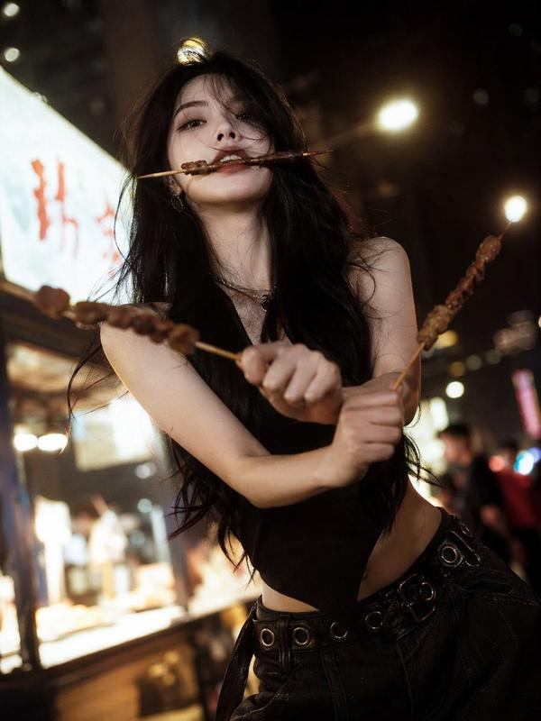
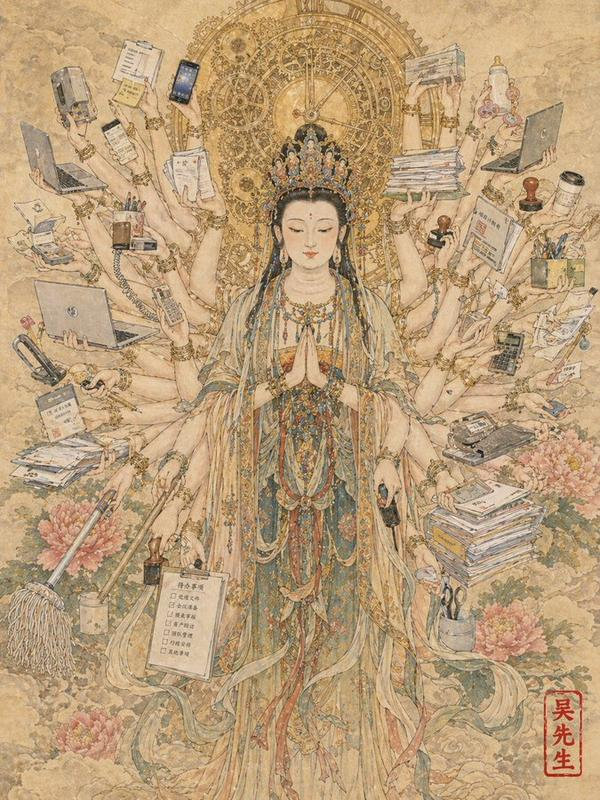
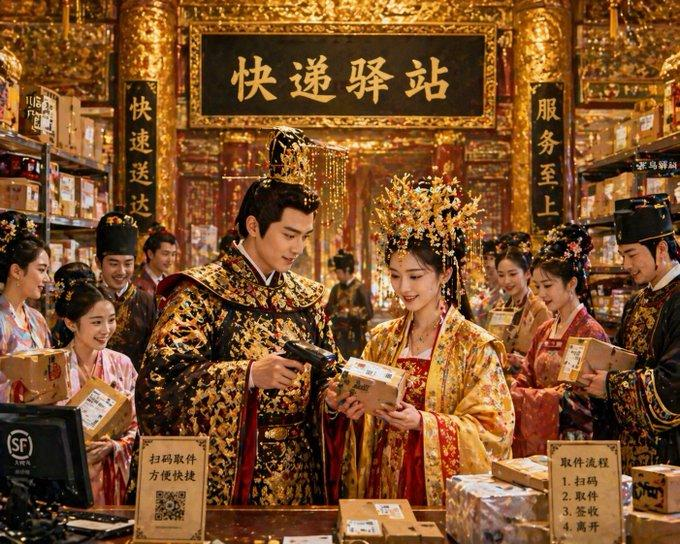
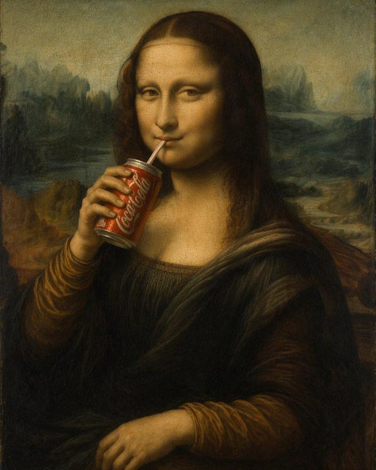
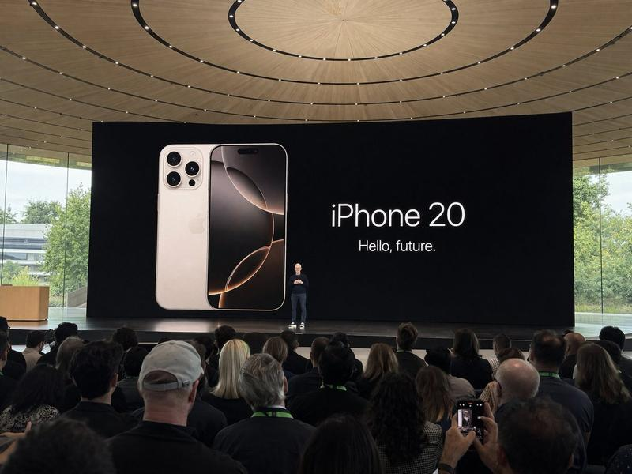

## 例 4：老干妈风味

**来源：** 小红书号989137706


```text
特朗普在抖音直播间卖老干妈，手里举着「老干妈风味」新品，背景还是 SpaceX 那种科技感，左下角弹幕飘着「特斯拉车主：求上链接」。
```

---

---

## 例 165：清冷佳人夜市烧烤三刀流

**来源：** [@BubbleBrain](https://x.com/BubbleBrain/status/2046564674112831920)




```text
[中文]
一个有着清冷孤傲气质的绝美佳人，精致的面部特征，一张冷酷且精致的高级时装面容，长发，以及优雅苗条的身材；烧烤“三刀流”姿势：嘴里叼着一根烧烤串，每只手各拿一根烧烤串交叉以模仿索隆的三刀流；街头夜景氛围，温暖黄色的夜市灯光，模糊的背景，胶片般的质感，柔焦光晕，电影般的叙事感，时髦高端网红风格的时尚拍摄，清晰发光的肌肤，清晰细致的发丝，生动的动态表情，低角度广角镜头，情绪化的暗调氛围，浅景深，超高清8K，极致细节，电影级光照

[English]
a stunning beauty with a cool, aloof atmosphere, delicate facial features, a cold and sophisticated high-fashion face, long hair, and a graceful slender figure; barbecue “three-sword style” pose: one barbecue skewer held in her mouth, one skewer in each hand crossed to mimic Zoro’s three-sword style; street night scene ambiance, warm yellow night market lighting, blurred background, film-like texture, soft-focus glow, cinematic storytelling feel, trendy high-end influencer-style fashion shoot, clear luminous skin, sharply detailed strands of hair, lively dynamic expression, low-angle wide-angle shot, moody dark-toned atmosphere, shallow depth of field, ultra HD 8K, extreme detail, cinematic lighting
```

---

---

## 例 193：千手观音化身打工人

**来源：** [@johnAGI168](https://x.com/johnAGI168/status/2046565555025367392)




```text
[中文]
一幅高度详细的千手观音菩萨工笔画。

然而，千手并没有拿着神圣的宗教法器，而是拿着现代办公和家用物品：**笔记本电脑、智能手机、成堆的文件、咖啡杯、印章、计算器、拖把和奶瓶**。它代表了终极的多任务处理现代工作者。

脑后的金色光环由旋转的时钟齿轮组成。

**在右下角，一个单一的红色竖排艺术家印章写着“吴先生”（Mr. Wu），风格化得像水印一样。** --ar 3:4

[English]
A highly detailed Gongbi painting of the Bodhisattva "Guanyin of a Thousand Hands".

However, instead of sacred religious artifacts, the thousand hands are holding modern office and household items: **laptops, smartphones, stacks of paperwork, coffee cups, stamps, calculators, mops, and baby bottles**. It represents the ultimate multi-tasking modern worker.

The golden aura behind the head is made of spinning clock gears.

**In the bottom right corner, a single red vertical artist chop seal reads "吴先生" (Mr. Wu), stylized like a watermark.** --ar 3:4
```

---

---

## 例 197：英雄联盟特朗普中路对决哈梅内伊

**来源：** [@underwoodxie96](https://x.com/underwoodxie96/status/2046529342415790275)


```text
[中文]
帮我生成一张特朗普对战哈梅内伊在英雄联盟中路对线的截图。

[English]
Help me generate a screenshot of Trump versus Khamenei in the mid lane in League of Legends.
```

---

---

## 例 203：杠精视角的独特文案创意

**来源：** [@joshesye](https://x.com/joshesye/status/2046596222505361866)


```text
[中文]
杠精视角文案 + GPT Image 2

[English]
Troll perspective copywriting + GPT Image 2
```

---

---

## 例 205：皇宫深处的御用快递驿站

**来源：** [@joshesye](https://x.com/joshesye/status/2046596222505361866)




```text
[中文]
生成一张古代皇宫 × 快递驿站

[English]
Generate an ancient imperial palace × express delivery station
```

---

---

## 例 233：蒙娜丽莎畅饮可乐的趣味油画

**来源：** [@liyue\_ai](https://x.com/liyue_ai/status/2045058142858555733)




```text
[中文]
生成一张蒙娜丽莎喝可乐的油画。

[English]
Generate an oil painting of Mona Lisa drinking cola.
```

---

---

## 例 259：精致女孩背后的网贷真相

**来源：** [@MrLarus](https://x.com/MrLarus/status/2045373105041007013)


```text
[中文]
生成小红书内容截图，主题：精致女孩背后都有网贷，iPhone尺寸

[English]
Generate Xiaohongshu content screenshot, theme: Behind every exquisite girl there is online loan, iPhone size
```

---

---

## 例 262：苹果园远观库克发布新机

**来源：** [@austinit](https://x.com/patrickassale/status/2044687244368441742)




```text
[中文]
在Apple Park iPhone 20主题演讲期间拍摄的业余iPhone照片，蒂姆·库克在舞台上演讲。从远处的观众人群中拍摄

[English]
Amateur iPhone photo at Apple Park during the iPhone 20 keynote, Tim Cook presenting on stage. Shot from the crowd at a distance
```

---

## 例 265：生成一个抖音直播的截图 里面是一个美女在直播，在卖丝袜和内衣，她的在线人数是99996，热度是18+，有个叫小互的大哥，给她刷了一个飞机礼物

**来源：** [@xiaohu](https://x.com/xiaohu/status/2046536551681954207)

```text
生成一个抖音直播的截图 里面是一个美女在直播，在卖丝袜和内衣，她的在线人数是99996，热度是18+，有个叫小互的大哥，给她刷了一个飞机礼物
```

---

---

## 例 269：generate image: Selfie of Sam Altman riding a bear...

**来源：** [@JustinGorya](https://x.com/JustinGorya/status/2046510831832006970)

```text
generate image: Selfie of Sam Altman riding a bear

Edit prompt: Remove the background make it transparent
```

---

---

## 例 272：在计算机博物馆里，一个程序员在展厅中央，正在演示C语言编程，很多参观者在围观，屏幕上的代码清晰可见。旁边的牌子写着：古法编程，现场表演。2D卡通画风，16:9

**来源：** [@XiaohuiAI666](https://x.com/XiaohuiAI666/status/2046515319947354603)

```text
在计算机博物馆里，一个程序员在展厅中央，正在演示C语言编程，很多参观者在围观，屏幕上的代码清晰可见。旁边的牌子写着：古法编程，现场表演。2D卡通画风，16:9
```

---

---

## 例 281：サムアルトマンがメジャーリーガーでバットを構えている。よくあるようなテレビ画面の構図

**来源：** [@16kthir0GRXgNqn](https://x.com/16kthir0GRXgNqn/status/2046507362266259832)

```text
サムアルトマンがメジャーリーガーでバットを構えている。よくあるようなテレビ画面の構図
```

---

---

## 例 283：Anachronistic Beauty Tutorial

**来源：** awesome-gpt-image-2

```text
Pan Jinlian posting a beauty tutorial on Bilibili titled "How to Conceal Blemishes Using Ancient Methods," with bullet comments saying "Sister-in-law's technique is amazing!"
```

---

---

## 例 304：大唐玄武门之变的朋友圈

**来源：** [@Tz\_2022](https://x.com/Tz_2022/status/2046523491940225366)

```text
[中文]
玄武门之变的朋友圈

[English]
WeChat Moments of the Xuanwu Gate Incident
```

---

---

## 例 308：杜甫朋友圈吐槽茅屋被掀翻

**来源：** [@MrLarus](https://x.com/MrLarus/status/2046585220393324553)

```text
[中文]
杜甫发朋友圈吐槽房顶被风刮没了

[English]
Du Fu posting on WeChat Moments complaining about his roof being blown away by the wind
```

---

---

## 例 309：武则天发微博自拍太魔性了

**来源：** [@MrLarus](https://x.com/MrLarus/status/2046585220393324553)

```text
[中文]
武则天自拍登记发微博

[English]
Wu Zetian taking a selfie, registering and posting on Weibo.
```

---

---

## 例 313：朱元璋登基后的推特主页

**来源：** [@liyue\_ai](https://x.com/liyue_ai/status/2045021302315249738)

```text
[中文]
创建一个明朝朱元璋登基之后的X帖子页面

[English]
Create an X post page of Zhu Yuanzhang after his ascension to the throne in the Ming Dynasty
```

---

---

## 例 316：威化岛回军前夕李成桂动态

**来源：** [@SKA\_Neotype](https://x.com/SKA_Neotype/status/2044637900978217334)

```text
[中文]
태조 이성계의 X  페이지(위화도 회군을 벌이기 직전- 최영 장군과 서로 디스하는 내용이 담긴 게시글들)을 만들어 주세요.

[English]
Please create an X page of King Taejo Yi Seong-gye (right before carrying out the Wihwa Island Retreat - containing posts where he and General Choi Yeong are dissing each other).
```

---

---

## 例 318：明朝登基宝玉的推文页面

**来源：** [@tuzi\_ai](https://x.com/tuzi_ai/status/2045193918736736365)

```text
[中文]
创建一个宝玉（查阅 https://x.com/dotey 这个推主的主页及部分推文）穿越到明朝，登基之后依据其业务/个性，绘制的其新的X帖子页面。

[English]
Create a new X post page illustrated for Baoyu (refer to the homepage and some posts of this Twitter user at https://x.com/dotey) after time-traveling to the Ming Dynasty and ascending the throne, based on his business/personality.
```

---

---
