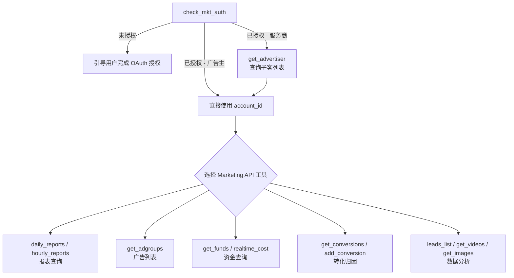

# Tenctent Marketing Solution MCP — 腾讯营销原子能力连接器

将账户授权、组织与广告主管理、报表查询、广告与素材管理、转化归因、创意审核与素材修复、广告知识库搜索、创意灵感推荐、视频号直播数据等原子能力统一封装为 MCP 工具，供 AI Agent 按需编排调用，实现广告投放全链路的智能化操作。

## 能力域概览

| 能力域 | 工具数 | 说明 |
|--------|--------|------|
| 🔐 授权管理 | 1 | 检查腾讯广告 OAuth 授权状态，获取已授权账户列表 |
| 🏢 组织管理查询 | 5 | 广告主列表、业务单元、组织账号关系等 |
| 📊 报表查询 | 2 | 日报表、小时报表，支持多维度聚合 |
| 💰 基础信息查询 | 8 | 资质、操作日志、资金账户、钱包、实时消耗等 |
| 📢 广告管理 | 1 | 获取广告列表 |
| 📈 数据分析 | 3 | 线索列表、视频素材、图片素材查询 |
| 🔄 转化归因 | 2 | 获取/新增转化归因 |
| 🎨 创意审核与素材修复 | 6 | 创意元素审核、组件审核、违规解读、预审核、预审核结果查询、素材修复 |
| 🧠 知识库与灵感 | 2 | 广告知识库搜索、高曝光优质创意灵感推荐 |
| 📺 视频号直播 | 5 | 视频号登录、直播历史、直播详情、投流报表 |

---

## 工具列表

### 🔐 授权管理（1 个）

#### `check_mkt_auth`

检查腾讯广告账户的 OAuth 授权状态。未授权时返回授权链接；已授权时返回用户已授权的全部账户列表（含服务商/广告主类型）。

> **重要**：这是调用 Marketing API 相关工具（组织管理、报表查询、基础信息、广告管理、数据分析、转化归因）的前置步骤。服务商账户需先调用 `get_advertiser` 查询子客列表，再用广告主 `account_id` 调用报表等工具。
>
> **鉴权机制**：Token 是 Marketing API 操作指定账号的身份凭证，操作特定广告账号时，需使用该广告账号对开发者应用授权以获取 `access_token` 和 `refresh_token`；接口通过请求参数中的 `access_token` 进行身份认证和鉴权，系统在 access_token 有效、调用配额未用完、调用频次未超限三个条件均满足后接受请求并处理业务。
>
> **注意**：创意审核与素材修复、知识库与灵感、视频号直播等工具不依赖 Marketing API 授权，无需 `check_mkt_auth` 前置。

| 参数 | 类型 | 必填 | 说明 |
|------|------|------|------|
| （无参数） | — | — | 仅需用户已完成 WorkBuddy 登录 |

---

### 🏢 组织管理查询（5 个）

> 来源：`Marketing API`

#### `get_advertiser`

查询广告主账户信息。服务商场景传 `agency_id` 查询下属全部广告主；直客场景传 `account_id` 查询自身。

| 参数 | 类型 | 必填 | 说明 |
|------|------|------|------|
| `agency_id` | number | 服务商必填 | 服务商账号 ID（check_mkt_auth 返回的 ACCOUNT_TYPE_AGENCY 账户） |
| `account_id` | number | 直客必填 | 广告主账号 ID，代理商可不填 |
| `fields` | string[] | ✅ | 返回字段列表，如 `account_id`、`corporation_name`、`daily_budget`、`system_status` |
| `pagination_mode` | enum | ✅ | `PAGINATION_MODE_NORMAL` / `PAGINATION_MODE_CURSOR` |
| `page_size` | number | ✅ | 每页数量，1~100 |
| `page` | number | ❌ | 普通翻页页码，1~1000 |
| `cursor` | number | ❌ | 游标翻页值 |
| `filtering` | struct[] | ❌ | 过滤条件，field 可选 `corporation_name` |

#### `business_unit_list`

查询广告主的业务单元列表。

| 参数 | 类型 | 必填 | 说明 |
|------|------|------|------|
| `account_id` | number | ✅ | 广告主账号 ID |
| `page` | number | ❌ | 页码，默认 1 |
| `page_size` | number | ❌ | 每页数量，默认 10，最大 100 |

#### `agency_business_unit_list`

查询服务商下的业务单元列表。

| 参数 | 类型 | 必填 | 说明 |
|------|------|------|------|
| `account_id` | number | ✅ | 服务商账号 ID |
| `page` | number | ❌ | 页码，默认 1 |
| `page_size` | number | ❌ | 每页数量，默认 10，最大 100 |

#### `organization_account_relation`

查询组织与账号的归属关系。

| 参数 | 类型 | 必填 | 说明 |
|------|------|------|------|
| `account_id` | number | ✅ | 广告主账号 ID |
| `page` | number | ❌ | 页码，默认 1 |
| `page_size` | number | ❌ | 每页数量，默认 10，最大 100 |

#### `agency_business_unit_list_account`

查询服务商业务单元下的账号列表。

| 参数 | 类型 | 必填 | 说明 |
|------|------|------|------|
| `account_id` | number | ✅ | 服务商账号 ID |
| `business_unit_id` | number | ✅ | 业务单元 ID |
| `page` | number | ❌ | 页码，默认 1 |
| `page_size` | number | ❌ | 每页数量，默认 10，最大 100 |

---

### 📊 报表查询（2 个）

> 来源：`Marketing API`

#### `daily_reports`

查询腾讯广告日报表数据，支持多层级聚合，800+ 指标，最多查 365 天。

| 参数 | 类型 | 必填 | 说明 |
|------|------|------|------|
| `account_id` | number | ❌ | 广告主账号 ID，不支持代理商 ID |
| `level` | enum | ✅ | 报表层级：`REPORT_LEVEL_ADVERTISER` / `REPORT_LEVEL_ADGROUP` / `REPORT_LEVEL_DYNAMIC_CREATIVE` 等 |
| `date_range` | object | ✅ | `{"start_date":"YYYY-MM-DD","end_date":"YYYY-MM-DD"}` |
| `group_by` | string[] | ✅ | 聚合维度，如 `["date"]`、`["date","adgroup_id"]` |
| `fields` | string[] | ✅ | 返回指标字段，如 `cost`、`view_count`、`conversions_count` |
| `filtering` | struct[] | ❌ | 过滤条件，最多 40 个 |
| `order_by` | struct[] | ❌ | 排序条件，最多 2 个 |
| `time_line` | enum | ❌ | 时间口径：`REQUEST_TIME` / `REPORTING_TIME` / `ACTIVE_TIME` |
| `page` | number | ❌ | 页码，默认 1，最大 99999 |
| `page_size` | number | ❌ | 每页数量，默认 10，最大 2000 |
| `organization_id` | number | ❌ | 业务单元 ID |

#### `hourly_reports`

查询腾讯广告小时报表数据，`start_date` 必须等于 `end_date`（单天），最多查 90 天。

| 参数 | 类型 | 必填 | 说明 |
|------|------|------|------|
| `account_id` | number | ✅ | 广告主账号 ID |
| `level` | enum | ✅ | 报表层级 |
| `date_range` | object | ✅ | `{"start_date":"YYYY-MM-DD","end_date":"YYYY-MM-DD"}`（须同一天） |
| `group_by` | string[] | ✅ | 聚合维度，通常含 `"hour"` |
| `fields` | string[] | ✅ | 返回指标字段 |
| `filtering` | struct[] | ❌ | 过滤条件 |
| `order_by` | struct[] | ❌ | 排序条件 |
| `time_line` | enum | ❌ | 时间口径 |
| `page` | number | ❌ | 页码，默认 1，最大 100 |
| `page_size` | number | ❌ | 每页数量，默认 10，最大 2000 |

---

### 💰 基础信息查询（8 个）

> 来源：`Marketing API`

#### `get_qualifications`

查询广告主资质信息。

| 参数 | 类型 | 必填 | 说明 |
|------|------|------|------|
| `account_id` | number | ✅ | 广告主账号 ID |
| `qualification_type` | enum | ✅ | `INDUSTRY_QUALIFICATION` / `AD_QUALIFICATION` / `ADDITIONAL_INDUSTRY_QUALIFICATION` |
| `filtering` | struct[] | ❌ | 按 `qualification_id` 过滤 |

#### `operation_log_list`

查询广告操作日志，不支持查 3 个月前的数据。

| 参数 | 类型 | 必填 | 说明 |
|------|------|------|------|
| `account_id` | number | ✅ | 广告主账号 ID |
| `operation_object_type` | enum | ✅ | `OPERATION_OBJECT_TYPE_ADGROUP` / `OPERATION_OBJECT_TYPE_JOINT_BUDGET` |
| `start_date` | string | ✅ | 开始日期 YYYY-MM-DD |
| `end_date` | string | ✅ | 结束日期 YYYY-MM-DD（与 start_date 差不超过 1 个月） |
| `page` | number | ✅ | 页码，1~100 |
| `page_size` | number | ✅ | 每页数量，1~100 |
| `object_id` | number | ❌ | 操作对象 ID |
| `operator_platform_list` | string[] | ❌ | 操作平台列表 |
| `operation_action_list` | string[] | ❌ | 操作动作列表 |

#### `get_funds`

获取广告主资金账户信息。

| 参数 | 类型 | 必填 | 说明 |
|------|------|------|------|
| `account_id` | number | ✅ | 广告主账号 ID |

#### `get_wallet`

获取广告主钱包信息。

| 参数 | 类型 | 必填 | 说明 |
|------|------|------|------|
| `account_id` | number | ✅ | 广告主账号 ID |

#### `daily_balance_report`

获取资金账户日结明细，单次查询跨度不超过 10 天。

| 参数 | 类型 | 必填 | 说明 |
|------|------|------|------|
| `account_id` | number | ✅ | 广告主账号 ID |
| `date_range` | object | ✅ | 日期范围（跨度 ≤ 10 天） |
| `page` | number | ❌ | 页码 |
| `page_size` | number | ❌ | 每页数量 |

#### `fund_statements_detailed`

获取资金账户流水，支持代理商和广告主。

| 参数 | 类型 | 必填 | 说明 |
|------|------|------|------|
| `account_id` | number | ✅ | 推广账号 ID（支持代理商和广告主） |
| `fund_type` | enum | ✅ | 资金账户类型：`FUND_TYPE_CASH` / `FUND_TYPE_GIFT` / `FUND_TYPE_SHARED` 等 |
| `date_range` | object | ✅ | 日期范围（支持两年内） |
| `page` | number | ❌ | 页码 |
| `page_size` | number | ❌ | 每页数量 |
| `primary_key` | string | ❌ | 翻页游标 |

#### `realtime_cost`

获取实时消耗余额，只支持查今天。

| 参数 | 类型 | 必填 | 说明 |
|------|------|------|------|
| `account_id` | number | ✅ | 广告主账号 ID |
| `level` | enum | ✅ | `ADVERTISER` / `ADGROUP` / `ADTOTAL` |
| `date` | string | 条件必填 | 查询日期（level=ADTOTAL 时不需要） |
| `filtering` | struct[] | 条件必填 | level=ADGROUP/ADTOTAL 时必填 |
| `page` | number | ❌ | 页码 |
| `page_size` | number | ❌ | 每页数量 |

#### `agency_realtime_cost`

获取服务商实时消耗。

| 参数 | 类型 | 必填 | 说明 |
|------|------|------|------|
| `account_id` | number | ✅ | 服务商账号 ID |

---

### 📢 广告管理（1 个）

> 来源：`Marketing API`

#### `get_adgroups`

获取广告列表，查询指定广告主下的广告信息。

| 参数 | 类型 | 必填 | 说明 |
|------|------|------|------|
| `account_id` | number | ✅ | 广告主账号 ID，不支持代理商 ID |
| `filtering` | struct[] | ❌ | 过滤条件（adgroup_id / adgroup_name / created_time / configured_status 等） |
| `page` | number | ❌ | 页码，1~100，默认 1 |
| `page_size` | number | ❌ | 每页数量，1~100，默认 10 |
| `is_deleted` | boolean | ❌ | 是否查询已删除广告 |
| `fields` | string[] | ❌ | 返回字段列表（adgroup_id / adgroup_name / configured_status / daily_budget 等） |
| `pagination_mode` | enum | ❌ | `PAGINATION_MODE_NORMAL` / `PAGINATION_MODE_CURSOR` |
| `cursor` | string | ❌ | 游标翻页值 |

---

### 📈 数据分析（3 个）

> 来源：`Marketing API`

#### `leads_list`

获取线索列表，前 5000 条用 page 翻页，超过后用 `last_search_after_values` 深度翻页。

| 参数 | 类型 | 必填 | 说明 |
|------|------|------|------|
| `account_id` | number | ✅ | 广告主账号 ID |
| `time_range` | object | ✅ | `{"start_time":<秒级时间戳>,"end_time":<秒级时间戳>}`，最长 1 年 |
| `time_type` | enum | ✅ | `TIME_TYPE_CREATED_TIME` / `TIME_TYPE_ACTION_TIME` |
| `page` | number | ❌ | 页码，1~1000（仅前 5000 条） |
| `page_size` | number | ❌ | 每页数量，1~200 |
| `last_search_after_values` | string[] | ❌ | 深度翻页参数（超过 5000 条时必填） |

#### `get_videos`

获取视频素材列表。

| 参数 | 类型 | 必填 | 说明 |
|------|------|------|------|
| `account_id` | number | 二选一 | 广告主账号 ID |
| `organization_id` | number | 二选一 | 业务单元 ID |
| `filtering` | struct[] | ❌ | 过滤条件（video_id / media_id / created_time 等） |
| `page` | number | ❌ | 页码 |
| `page_size` | number | ❌ | 每页数量，最大 100 |
| `label_id` | number | ❌ | 素材标签 ID |
| `business_scenario` | number | ❌ | 1=内容素材包，2=投放素材包 |
| `need_aigc_flag` | boolean | ❌ | 是否返回 AI 标识 |

#### `get_images`

获取图片素材列表，不传 `created_time` 过滤条件时默认查半年内数据。

| 参数 | 类型 | 必填 | 说明 |
|------|------|------|------|
| `account_id` | number | 二选一 | 广告主账号 ID |
| `organization_id` | number | 二选一 | 业务单元 ID |
| `filtering` | struct[] | ❌ | 过滤条件（image_id / created_time 等） |
| `page` | number | ❌ | 页码 |
| `page_size` | number | ❌ | 每页数量，最大 100 |
| `label_id` | number | ❌ | 素材标签 ID |
| `business_scenario` | number | ❌ | 1=内容素材包，2=投放素材包 |
| `need_aigc_flag` | boolean | ❌ | 是否返回 AI 标识 |

---

### 🔄 转化归因（2 个）

> 来源：`Marketing API`

#### `get_conversions`

获取转化归因列表。

| 参数 | 类型 | 必填 | 说明 |
|------|------|------|------|
| `account_id` | number | ✅ | 广告主账号 ID（支持代理商和广告主） |
| `filtering` | struct[] | ❌ | 过滤条件（conversion_id / conversion_name / optimization_goal 等），最多 10 个 |
| `fields` | string[] | ❌ | 返回字段列表 |
| `page` | number | ❌ | 页码 |
| `page_size` | number | ❌ | 每页数量，最大 100 |

#### `add_conversion`

新增转化归因（POST 写入）。

| 参数 | 类型 | 必填 | 说明 |
|------|------|------|------|
| `account_id` | number | ✅ | 广告主账号 ID |
| `conversion_name` | string | ✅ | 转化名称，最大 60 等宽字符 |
| `access_type` | enum | ✅ | 上报方式：`ACCESS_TYPE_SDK` / `ACCESS_TYPE_API` / `ACCESS_TYPE_JS` |
| `conversion_scene` | enum | ✅ | 转化场景：`CONVERSION_SCENE_ANDROID` / `CONVERSION_SCENE_IOS` / `CONVERSION_SCENE_WEB` 等 |
| `claim_type` | enum | ✅ | 归因方式：`CLAIM_TYPE_ACTIVATION` / `CLAIM_TYPE_CLICK` / `CLAIM_TYPE_REGISTER` 等 |
| `self_attributed` | boolean | ✅ | 是否自归因（API 必须 true，SDK/JS 必须 false） |
| `optimization_goal` | enum | ✅ | 优化目标类型 |
| `marketing_carrier_id` | string | ❌ | 营销载体 ID |
| `feedback_url` | string | ❌ | 点击监测链接 |
| `landing_page_url` | string | ❌ | 推广落地页链接 |
| `mini_program_id` | string | ❌ | 小程序 appid |
| *(更多可选参数)* | — | ❌ | deep_behavior_optimization_goal、deep_worth_optimization_goal 等 |

---

### 🎨 创意审核与素材修复（6 个）

> 提供创意元素审核、组件审核、违规解读、预审核、素材修复等能力。
>
> 本能力域不依赖 Marketing API 授权，无需 `check_mkt_auth` 前置。

#### `get_creative_element_audit_result`

获取指定创意的元素审核结果，包括各创意元素（视频、图片、文案、落地页等）的审核状态和拒绝原因。

| 参数 | 类型 | 必填 | 说明 |
|------|------|------|------|
| `account_id` | number | ✅ | 广告账户 ID |
| `dynamic_creative_id` | number | ✅ | 动态创意 ID |
| `component_id` | number | ❌ | 组件 ID，筛选指定组件 |
| `review_status` | string[] | ❌ | 审核状态：`NORMAL` / `PENDING` / `DENIED` / `PARTIALLY_NORMAL` |

#### `get_component_audit_result`

获取指定组件的审核结果，包括组件信息及关联元素审核详情。

| 参数 | 类型 | 必填 | 说明 |
|------|------|------|------|
| `account_id` | number | ✅ | 广告账户 ID |
| `component_id_list` | number[] | ✅ | 组件 ID 列表，最多 100 个 |

#### `creative_element_denied_explain`

获取创意元素被拒绝的违规原因解读。

| 参数 | 类型 | 必填 | 说明 |
|------|------|------|------|
| `account_id` | number | ✅ | 广告账户 ID |
| `dynamic_creative_id` | number | ✅ | 动态创意 ID |
| `element_fingerprint` | string | ✅ | 元素指纹 |

#### `prereview_element`

预审核广告创意元素，提交元素内容进行预审核，返回预审核任务 ID。

| 参数 | 类型 | 必填 | 说明 |
|------|------|------|------|
| `uid` | number | ✅ | 广告主账户 ID |
| `element_type` | enum | ✅ | `ELEMENT_TYPE_TEXT` / `ELEMENT_TYPE_IMAGE` / `ELEMENT_TYPE_VIDEO` / `ELEMENT_TYPE_URL` |
| `element_content` | string | ✅ | 元素内容（文字填文本，图片/视频/落地页填 URL） |
| `site_set` | string[] | ✅ | 投放版位列表，默认 `["SITE_SET_WECHAT"]` |
| `element_fingerprint` | string | ❌ | 元素物理指纹 |
| `element_key` | string | ❌ | 元素位置 |
| `aid` | number | ❌ | 广告 ID |

#### `get_element_prereview`

查询元素预审核结果，根据 `task_id` 获取预审核进度和结果。

| 参数 | 类型 | 必填 | 说明 |
|------|------|------|------|
| `task_id` | string | ✅ | 预审核任务 ID（由 `prereview_element` 返回） |

#### `repair_material`

修复广告创意素材，支持文本修复（自动替换违规词）和图片修复（自动修正违规内容）。

| 参数 | 类型 | 必填 | 说明 |
|------|------|------|------|
| `repair_type` | enum | ✅ | `ELEMENT_TYPE_TEXT`（文本修复）/ `ELEMENT_TYPE_IMAGE`（图片修复） |
| `text_request` | object | 条件必填 | 文本修复请求（repair_type=TEXT 时） |
| `image_request` | object | 条件必填 | 图片修复请求（repair_type=IMAGE 时） |

---

### 🧠 知识库与灵感（2 个）

> 提供广告知识库搜索和高曝光优质创意灵感推荐能力。
>
> 本能力域不依赖 Marketing API 授权，无需 `check_mkt_auth` 前置。

#### `search_tencent_ad_knowledge`

搜索腾讯广告投放相关知识，包括投放流程、策略、广告创建、账户管理等。

| 参数 | 类型 | 必填 | 说明 |
|------|------|------|------|
| `query` | string | ✅ | 搜索查询关键词 |

#### `get_top_good_creative`

获取高曝光优质创意灵感，根据关键词搜索相关行业的高曝光广告创意素材，返回创意特点总结和素材排行列表。

| 参数 | 类型 | 必填 | 说明 |
|------|------|------|------|
| `query` | string | ✅ | 搜索查询关键词（行业、产品类型等） |

---

### 📺 视频号直播（5 个）

#### `list_user_channel_logins`

查询用户已登录视频号列表（含等待扫码与已登录两种态）。

| 参数 | 类型 | 必填 | 说明 |
|------|------|------|------|
| `c_user_id` | number | ✅ | 用户 ID（由中间件自动注入） |

#### `fetch_channel_login_qr`

生成新的视频号登录 relation_id 并下发二维码。

| 参数 | 类型 | 必填 | 说明 |
|------|------|------|------|
| `c_user_id` | number | ✅ | 用户 ID（由中间件自动注入） |

#### `list_channel_live_history`

查询指定视频号的历史直播列表。

| 参数 | 类型 | 必填 | 说明 |
|------|------|------|------|
| `relation_id` | string | ✅ | 视频号关联 ID |
| `uniq_id` | string | ✅ | 视频号唯一 ID |
| `platform_type` | number | ❌ | 平台类型，默认 1（视频号） |
| `start_time` | number | ❌ | 起始时间戳（秒） |
| `end_time` | number | ❌ | 结束时间戳（秒） |
| `current_page` | number | ❌ | 页码，从 1 开始 |
| `page_size` | number | ❌ | 每页条数 |

#### `get_channel_live_detail`

查询指定直播间的详细指标数据。

| 参数 | 类型 | 必填 | 说明 |
|------|------|------|------|
| `relation_id` | string | ✅ | 视频号关联 ID |
| `uniq_id` | string | ✅ | 视频号唯一 ID |
| `live_object_id` | string | ✅ | 直播对象 ID（从 `list_channel_live_history` 返回） |
| `platform_type` | number | ❌ | 平台类型，默认 1 |

#### `get_live_ad_report`

查询指定账号 + 直播间的广告投放效果（投流报表）。

| 参数 | 类型 | 必填 | 说明 |
|------|------|------|------|
| `c_user_id` | number | ✅ | 用户 ID（由中间件自动注入） |
| `account_id` | number | ✅ | 投流账号 ID |
| `live_id` | string | ✅ | 直播间 ID |

---

## 典型调用流程

> 创意审核与素材修复、知识库与灵感、视频号直播等工具不依赖 Marketing API 授权，可直接按需调用，无需经过 `check_mkt_auth`。

## 注意事项

1. **鉴权前置（仅 Marketing API 工具）**：组织管理、报表查询、基础信息、广告管理、数据分析、转化归因等工具调用前，需先通过 `check_mkt_auth` 确认授权状态；创意审核与素材修复、知识库与灵感、视频号直播等工具不依赖该授权
2. **服务商 vs 广告主**：服务商账户不能直接用于 `daily_reports` 等报表查询，需先通过 `get_advertiser` 获取广告主 `account_id`
3. **account_id 限制**：大部分工具的 `account_id` 不支持代理商 ID（`get_advertiser` 和 `fund_statements_detailed` 除外）
4. **分页方式**：支持普通翻页（`page`）和游标翻页（`cursor`）两种模式，大数据量建议使用游标翻页
5. **c_user_id 自动注入**：视频号直播相关工具的 `c_user_id` 由中间件自动注入，无需 AI 手动传递
