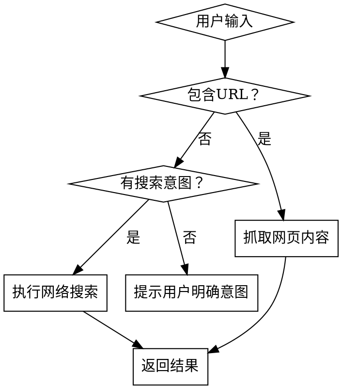

# 网络搜索

## 概述

网络搜索工具，支持使用搜索引擎API进行实时网络搜索，并可选地抓取网页全文内容。基于搜索引擎API和 r.jina.ai 内容抓取服务，提供简洁的JSON或Markdown格式输出。

**核心能力**:
- ✅ 内容搜索（Markdown格式）
- ✅ 智能错误处理和网络适配
- ✅ 中文友好，支持中英文混合搜索
- ✅ **智能意图识别**：只在有明确搜索意图时才搜索
- ✅ **智能URL检测**：自动识别URL并抓取内容
- ✅ **增强超时处理**：搜索60秒、抓取90秒超时，避免"The read operation timed out"错误
- ✅ **支持按时间范围过滤搜索结果**：根据用户查询中的时间意图，自动传入 `--days` 参数进行范围检索

## 使用场景

**适用**:
- 用户明确要求"搜索XX信息"
- 需要查询实时新闻、价格、数据
- 需要获取外部网站的详细内容
- 本地知识库中没有的信息

**不适用**:
- 只需本地文件搜索的场景
- 已知具体URL只需打开的场景
- 需要登录认证的内容

## 快速开始

用户问: **"帮我搜索一下存款十万如何做稳健投资"**

执行:
```bash
python scripts/web_search.py "存款十万如何做稳健投资"
```

若用户查询包含时间范围（如"最近一周的劳动仲裁新闻"），需根据时间意图传入 `--days` 参数：
```bash
python scripts/web_search.py "最近一周的劳动仲裁新闻" --days=7
```

脚本会:
1. 调用搜索引擎API查询
2. 聚合多引擎结果
3. 输出JSON格式结果（或可选Markdown）

读取结果并以Markdown格式呈现给用户。

## 工作流程（智能决策）

### 智能决策流程



**关键原则**:
- ✅ **用户提供具体URL** → 直接抓取内容（跳过搜索）
- ✅ **用户有明确搜索意图** → 执行搜索
- ✅ **无明确搜索意图** → 提示用户明确需求
- ✅ **智能检测URL格式和搜索关键词**，无需手动指定模式

**搜索意图识别关键词**:
- 中文：搜索、查找、查询、找一下、帮我找、关于、是什么、怎么样、如何、最新、新闻、资讯、推荐、建议、教程、指南等
- 英文：search、find、what is、how to、latest、news、recommend、tutorial等

### 模式1：智能搜索（自动检测URL）

脚本会自动检测输入是否包含URL，并选择合适的处理方式：

```bash
# 情况1：纯关键词搜索
python scripts/web_search.py "存款十万如何做稳健投资"
# → 执行搜索

# 情况2：包含URL，自动抓取
python scripts/web_search.py "https://my.feishu.cn/wiki/HbbywPBIliyVilkdIQNcKoQSnKb"
# → 直接抓取网页内容

# 情况3：包含URL的混合查询
python scripts/web_search.py "帮我看看这个链接 https://example.com/article"
# → 自动识别URL并抓取
```

### 模式2：搜索模式（关键词查询）

当用户只提供关键词时：

```bash
# 基本搜索
python scripts/web_search.py "查询关键词"
```

**参数说明**:
- `query`: 搜索查询字符串（必填，如果包含URL会自动切换为抓取模式）
- `--days`: 时间范围过滤（可选）。根据用户查询中的时间意图传入对应值：
  - `1` - 1天内
  - `7` - 1周内
  - `30` - 1个月内
  - `365` - 1年内
  - `0` 或不传 - 不限（默认）

### 模式3：强制抓取模式（可选）

如果需要明确指定抓取URL（通常不需要，因为会自动检测）：

```bash
# 明确指定抓取URL 确认好用户本地是python 或者是python3环境
python scripts/web_search.py --fetch "https://example.com/article"
```

### 使用建议

| 用户输入类型 | 自动选择模式 | 示例 |
|-------------|-------------|------|
| 纯关键词 | 搜索模式 | "存款十万如何理财" |
| 包含URL | 抓取模式 | "https://example.com/article" |
| 混合输入 | 抓取模式（提取URL） | "看看这个链接 https://..." |
| 多个URL | 抓取第一个URL | "链接1 https://a.com 和链接2 https://b.com" |

## 时间范围参数使用指南

### 调用规则

当用户查询中**明确包含时间范围意图**时，助手应在调用脚本时附加 `--days` 参数。时间意图由大模型根据用户自然语言查询自动理解并映射，**不在脚本层进行正则匹配**。

### 时间范围映射表

| 用户表达示例 | days 值 | 说明 |
|-------------|---------|------|
| 今天、1天内、24小时内、最近一天 | 1 | 检索最近24小时内的内容 |
| 本周、1周内、7天内、最近一周 | 7 | 检索最近7天内的内容 |
| 本月、1个月内、30天内、最近一个月 | 30 | 检索最近30天内的内容 |
| 今年、1年内、365天内、最近一年 | 365 | 检索最近365天内的内容 |
| 不限、所有时间、未提及时间 | 不传 | 后端默认不限时间范围 |

### 判断原则

1. **明确包含时间词**：如用户说"搜索最近一周的劳动仲裁新闻"，识别到"最近一周"，应传入 `--days=7`
2. **未提及时间**：如用户说"搜索劳动仲裁新闻"，未提及时间范围，**不传递 `--days` 参数**
3. **存在歧义时取更小范围**：如"最近一周的最新动态"同时涉及"一周"和"最新"，取更精确的 `days=1`
4. **禁止编造**：仅根据用户实际表述判断，不得臆测用户未表达的时间意图

### 调用示例

```bash
# 用户问"今天有哪些法律热点"
python scripts/web_search.py "今天有哪些法律热点" --days=1

# 用户问"搜索最近一个月的民间借贷案例"
python scripts/web_search.py "搜索最近一个月的民间借贷案例" --days=30

# 用户问"查询AI发展趋势"（未提时间）
python scripts/web_search.py "查询AI发展趋势"
```

## 输出格式

### 普通文本格式

```json
{
  "query": "存款十万如何做稳健投资",
  "number_of_results": 10,
  "search_time": "2026-03-18 15:30:00",
  "enabled_engines": ["google", "brave", "duckduckgo"],
  "unresponsive_engines": ["google"],
  "results": [
    {
      "title": "文章标题",
      "url": "https://example.com/article",
      "description": "文章描述摘要...",
      "engine": "duckduckgo"
    }
  ]
}
```

### 呈现给用户的Markdown格式

```markdown
# 🔍 "查询关键词" 搜索结果

> 📊 找到 N 条结果
> 🕐 搜索时间: 2026-03-18 15:30:00

---

## 1. 文章标题

**来源**: duckduckgo

**描述**: 文章描述摘要...

**链接**: [https://example.com/article](https://example.com/article)

---
```

## 示例对话

### 场景1：纯关键词搜索（有搜索意图）

**用户**: "帮我搜索一下最新的AI发展趋势"

**助手**: 我来为您搜索AI发展趋势的相关信息...

```bash
python scripts/web_search.py "搜索最新的AI发展趋势" 
```

**脚本输出**:
```
检测到搜索意图，执行搜索...
{
  "query": "搜索最新的AI发展趋势",
  "results": [...]
}
```

---

### 场景2：用户提供URL（自动抓取）

**用户**: "帮我看看这个飞书文档：https://my.feishu.cn/wiki/HbbywPBIliyVilkdIQNcKoQSnKb"

**助手**: 检测到您提供了链接，我来为您抓取内容...

```bash
python scripts/web_search.py "https://my.feishu.cn/wiki/HbbywPBIliyVilkdIQNcKoQSnKb"
```

**脚本输出**:
```
检测到URL，自动切换到抓取模式...
抓取: https://my.feishu.cn/wiki/HbbywPBIliyVilkdIQNcKoQSnKb
[网页内容...]
```

---

### 场景3：无搜索意图（拒绝并提示）

**用户**: "今天天气不错"

**助手**: 抱歉，我未能识别到明确的搜索意图...

```bash
python scripts/web_search.py "今天天气不错"
```

**脚本输出**:
```
提示: 未检测到明确的搜索意图
输入: "今天天气不错"

如需搜索，请在输入中包含明确的搜索关键词，例如:
  - '搜索 存款十万如何理财'
  - '查找最新的AI资讯'
  - '关于人工智能的最新消息'
  - '什么是量子计算'

如需抓取网页，请提供URL:
  - 'https://example.com/article'
```

---

### 场景4：混合输入（自动提取URL）

**用户**: "我想了解这个链接的内容 https://example.com/article 它讲的是什么？"

**助手**: 我检测到您提到了一个链接，让我为您抓取内容...

```bash
python scripts/web_search.py "我想了解这个链接的内容 https://example.com/article 它讲的是什么？"
```

**脚本输出**:
```
检测到URL，自动切换到抓取模式...
抓取: https://example.com/article
[网页内容...]
```

---

### 场景5：强制抓取模式

**用户**: "帮我抓取这个URL的内容：https://example.com/special-article"

**助手**: 我来为您抓取该页面的内容...

```bash
python scripts/web_search.py --fetch "https://example.com/special-article"
```

**脚本输出**:
```
[网页内容...]
```

### 场景6：带时间范围的搜索

**用户**: "帮我查找最近一周关于劳动仲裁的最新新闻"

**助手**: 检测到您希望查询最近一周的劳动仲裁新闻，我将按1周时间范围进行搜索...

```bash
python scripts/web_search.py "帮我查找最近一周关于劳动仲裁的最新新闻" --days=7
```

**脚本输出**:
```
检测到搜索意图，执行搜索...
{
  "query": "帮我查找最近一周关于劳动仲裁的最新新闻",
  "results": [...]
}
```

---

### 场景7：单日时间范围搜索

**用户**: "今天有哪些法律资讯"

**助手**: 您想查询今天的法律资讯，我将按1天内的時間范围进行搜索...

```bash
python scripts/web_search.py "今天有哪些法律资讯" --days=1
```

**脚本输出**:
```
检测到搜索意图，执行搜索...
{
  "query": "今天有哪些法律资讯",
  "results": [...]
}
```

---

## 常见问题

| 问题 | 解决方案 |
|------|----------|
| **无结果返回** | 尝试更通用的关键词；检查网络连接 |
| **引擎不可用** | 某些引擎可能受网络限制，结果会标注 `unresponsive_engines` |
| **需要更详细信息** | 使用 `--fetch` 抓取特定网页的全文内容 |
| **Windows执行失败** | 确保Python已安装；使用 `python` 而非 `python3` |

## 技术说明

- **搜索API**: 使用搜索引擎API进行聚合搜索
- **内容抓取**: 基于 r.jina.ai 服务，自动转换为Markdown
- **网络适配**: 自动处理超时和错误，提供友好的错误信息
- **编码支持**: 完整支持UTF-8，中英文混合搜索

## 注意事项

- ⚠️ 搜索结果取决于搜索引擎API的可用性
- ⚠️ 某些网站可能限制抓取，`--fetch` 可能失败
- ⚠️ 搜索结果不保证准确性，请交叉验证重要信息
- ✅ 建议使用多个搜索引擎以获得更全面的结果
