# 图表规格定义 — 刑事案件可视化

## 目录

- [§0 Mermaid 渲染健壮性约束](#0-mermaid-渲染健壮性约束)
- [§1 图表-条件映射矩阵](#1-图表-条件映射矩阵)
- [§2 case_flow 刑事流程图](#2-case_flow-刑事流程图)
- [§3 custody_timeline 羁押时间线](#3-custody_timeline-羁押时间线)
  - [§3.0 三档决策](#30-三档决策v230-强制v300-强化)
  - [§3.0.1 长档双图表架构](#301-长档双图表架构v230-新增v300-强化)
  - [§3.0.2 长档 HTML 双容器结构](#302-长档-html-双容器结构v231-新增v300-更新缩放按钮)
  - [§3.1 中档单图模板](#31-中档单图模板3-12-月)
  - [§3.2 短档单图模板](#32-短档单图模板3-月)
  - [§3.3 关键校验](#33-关键校验)
  - [§3.4 刑期执行段处理](#34-刑期执行段处理v230-重写)
  - [§3.5 法律信息密度准则](#35-法律信息密度准则v300-新增)
- [§4 sentencing_path 量刑路径图](#4-sentencing_path-量刑路径图)
- [§5 rights_map 当事人权益图](#5-rights_map-当事人权益图)
- [§6 defense_matrix 辩护策略矩阵](#6-defense_matrix-辩护策略矩阵)
- [§7 timeline 案件时间轴](#7-timeline-案件时间轴)
- [§8 funds_flow 资金流向图（条件触发：含资金数据）](#8-funds_flow-资金流向图)
- [§9 通用校验规则与失败动作](#9-通用校验规则与失败动作)

---

## §0 Mermaid 渲染健壮性约束

> 本节是 v2.2.0 核心变更，v3.0.0 新增渲染尺寸强制规范（§0.6）。所有 Mermaid 代码生成前**必须**对照本节检查。

### 0.1 关键字黑名单（绝对禁止）

| 类别 | 禁用字符/语法 | 原因 | 替代方案 |
|------|--------------|------|----------|
| Gantt 任务名 | `〔〕`（日式方括号） | Mermaid 任务名分隔符 | 改为「第91条」半角中文或纯文字 |
| Gantt 任务名 | `（）`（全角括号）+ 条款 | 与 Mermaid 解析规则冲突 | 改为「第91条」或纯文字 |
| Graph 标签 | `var(--color-xxx)` | Mermaid **不支持 CSS 变量** | 用实际色值 `#3b82f6` |
| quadrantChart | `quadrant-1/2/3/4` 中文标签 | 内部标签必须英文 | "Priority Action" 等 |
| quadrantChart | `"中文策略名"` 数据标签 | 中英混排易触发 bug | 全部英文 + 配套中文表格 |
| pie | 小数（如 `13.56`） | Mermaid pie 仅支持整数 | 改为整数（标签内说明原值） |
| pie | 单引号 `'` | 部分版本解析错误 | 用双引号或去掉 |
| timeline | 单条标签 > 60 字符 | 布局自动换行错位 | 缩短到 ≤10 汉字或拆条 |
| subgraph | 中文子图名 | 部分版本解析为乱码 | 用中文 + 半角冒号或半角引号 |
| 节点 ID | 含中文/特殊字符 | 渲染失败 | 英文+数字（如 `S1`, `a1`, `m1`） |
| 节点 ID | 含空格/连字符 | 部分版本错误 | 下划线或纯字母 |
| 所有图表 | Mermaid 不支持的语法 | 完全失败 | 用基础语法+组合 |

### 0.2 style 指令实际色值映射表

> Mermaid `style` 指令**只接受实际色值**。以下是从 CSS 变量到 Mermaid 色值的对照：

| 语义用途 | CSS 变量 | Mermaid 色值 | 用途 |
|----------|---------|-------------|------|
| 主色-淡 | `--color-primary-light` | `#eff6ff` | 一般节点背景 |
| 主色-中 | `--color-primary-medium` | `#3b82f6` | 一般节点边框/标题 |
| 主色-深 | `--color-primary-dark` | `#1e3a8a` | 表头/强调边框 |
| 强调-绿 | `--color-accent-light/medium` | `#dcfce7` / `#22c55e` | 正面/成功节点 |
| 警告-琥珀 | `--color-warning-light/medium` | `#fffbeb` / `#d97706` | 警示/量刑结果 |
| 危险-红 | `--color-danger-light/medium` | `#fef2f2` / `#dc2626` | 风险/量刑上限 |
| 信息-灰蓝 | `--color-info-light/medium` | `#f8fafc` / `#64748b` | 辅助/已完成节点 |
| 中性灰 | `--color-gray-200` | `#e2e8f0` | 一般边框 |
| 文字-白 | `--color-primary-text` | `#ffffff` | 深色背景上的文字 |
| 文字-深 | `--color-info-dark` | `#1e293b` | 节点文字 |

**使用规则**：

```
style NODE_ID fill:#eff6ff,stroke:#3b82f6,stroke-width:2px,color:#1e293b
```

### 0.3 节点 ID 命名规范

| 图表类型 | ID 模式 | 示例 | 数量上限 |
|---------|--------|------|---------|
| 流程图 | `S1`, `S2`, ..., `Sn` | `S1`, `S5`, `S9` | ≤20 |
| 决策 | `J1`, `J2`, ... | `J1`(数额), `J2`(情节) | ≤10 |
| 权益/分支 | `A1`, `B1`, `C1`, `D1` | `B1`(侦查-委托辩护) | 每分支≤6 |
| Gantt 任务 | `a1`, `a2`, `a3` | `a1`(拘留), `a2`(逮捕) | ≤15 |
| Gantt 里程碑 | `m1`, `m2`, `m3` | `m1`(抓获) | ≤10 |
| 矩阵 | 不需要 ID | 字符串直接引用 | 数据点≤12 |
| 饼图 | 不需要 ID | 字符串直接引用 | 类别≤10 |

**禁止**：中文 ID（如 `节点1`）、含空格 ID（如 `node 1`）、数字开头 ID（如 `1a`）。

### 0.4 节点文字行数与宽度

| 图表 | 单节点推荐行数 | 单节点推荐字符数 | 超出处理 |
|------|---------------|-----------------|---------|
| case_flow 流程图 | ≤4 行（`<br/>`） | ≤30 字符/行 | 拆分为多个阶段节点 |
| sentencing_path | ≤3 行 | ≤25 字符/行 | 简化措辞 |
| rights_map | ≤2 行 | ≤20 字符/行 | 短词+表格展开 |
| defense_matrix | 短语（≤4 词） | — | 拆字段或英文标签+中文表 |
| timeline | ≤10 字符/标签 | — | 拆条 |
| Gantt 任务 | ≤8 字符 | — | 简化任务名+表格展开 |

### 0.5 Mermaid 渲染尺寸强制规范（v3.0.0 新增）

> **v3.0.0 核心新增**：本节是解决图表渲染尺寸过小问题的关键。所有图表生成前**必须**按本节逐项检查。

#### 0.5.1 全局渲染参数（Mermaid 初始化，不可省略）

| 参数 | 值 | 说明 |
|------|----|------|
| `fontSize` | `'18px'` | 基础字号（v3.0.0 从 14px 提升，复杂图表压缩后等效 ~9.5px，勉强可读） |
| `useMaxWidth` | `false` | **关键**：关闭 Mermaid 的 SVG 容器宽适配，图表以自然宽度渲染 |
| `flowchart.htmlLabels` | `false` | SVG 原生文本缩放保真度远高于 HTML 标签模式 |
| `gantt.barHeight` | `30` | gantt 每行高度（px），避免多行重叠挤压 |
| `gantt.fontSize` | `14` | gantt 独立字号 |
| `gantt.barGap` | `6` | 任务间间距 |
| `gantt.topPadding` | `40` | gantt 顶部留白 |

#### 0.5.2 容器尺寸约束（CSS HARD_BLOCK，不可修改）

| 参数 | 值 | 说明 |
|------|----|------|
| `.page-container max-width` | `1100px` | 页面可用宽度 ~1036px（v3.0.0 从 820px 提升 34%） |
| `.mermaid-wrap max-height` | `2400px` | 长图表不被截断 |
| `.mermaid-wrap .mermaid svg` | `width:100%!important; max-width:none!important` | 覆盖 Mermaid JS 注入的 inline max-width，让 SVG 自然渲染 |

#### 0.5.3 图表信息密度硬上限

| 图表类型 | 上限 | 说明 |
|---------|------|------|
| graph LR/TD 流程图 | 节点 ≤ 12 | 超出拆为多图 |
| gantt | section ≤ 2，任务 ≤ 10，milestone ≤ 7 | v3.0.0 新增 section 上限（去除重叠层） |
| pie | 类别 ≤ 8 | 超出合并到"其他" |
| quadrantChart | 数据点 ≤ 12 | 超出区分主次筛选 |
| timeline | 事件 ≤ 25，单标签 ≤ 10 字符 | 超标签简化或拆条 |

#### 0.5.4 每类图表最小渲染尺寸（预警阈值）

| 图表类型 | 最小 SVG 宽度 | 最小 SVG 高度 | 不满足时动作 |
|---------|-------------|-------------|-------------|
| graph LR (6-8 节点) | ≥ 800px | ≥ 400px | 检查 fontSize + useMaxWidth |
| gantt (中档单图) | ≥ 700px | ≥ 300px | 检查 barHeight + section 数 |
| gantt (长档双图-图A) | ≥ 600px | ≥ 250px | 检查 section ≤ 2 |
| gantt (长档双图-图B) | ≥ 500px | ≥ 200px | 可接受 |
| quadrantChart | ≥ 500px | ≥ 400px | 检查尺度/标签 |
| pie | ≥ 400px | ≥ 350px | 检查类别数 |
| timeline | ≥ 500px | ≥ 200px | v3.0.0：timeline 不稳定时改用 gantt 替代 |

### 0.6 布局策略选择

| 节点数 | 流程图方向 | subgraph 分段 | 备注 |
|--------|-----------|--------------|------|
| ≤5 | `graph TD` 即可 | 不需要 | 单列 |
| 6-8 | `graph LR` + subgraph 3 段 | 强制分段 | 横向更宽 |
| 9-12 | `graph LR` + subgraph 4 段 | 强制分段 | 横向超长需缩放 |
| >12 | 拆为多个独立图表 | 必须 | 单图节点≤12 |

---

## §1 图表-条件映射矩阵

| 图表 | 触发条件 | 律师版 | 家属版 | Mermaid 类型 | 节点上限 |
|------|---------|--------|--------|-------------|---------|
| case_flow | 始终 | ✅ 完整版 | ✅ 简化版 | graph LR + subgraph | 12 |
| custody_timeline | 始终 | ✅ 含法条 | ✅ 含倒计时 | gantt | 10 任务 |
| sentencing_path | 有罪名 | ✅ 完整版 | ✅ 简化版 | graph TD | 12 |
| rights_map | 始终 | ✅ 含法条 | ✅ 通俗版 | graph LR + subgraph | 16 |
| defense_matrix | 仅律师版 | ✅ | ❌ | quadrantChart | 12 数据点 |
| timeline | 有日期 | ✅ | ✅ | timeline | 25 条 |
| funds_flow | 有资金数据 | ✅ | ❌ | pie | 10 类别 |

---

## §2 case_flow 刑事流程图

### 2.1 律师版结构（v2.2.0 规范，v3.0.0 沿用）

> **强制**：节点 ≥6 时**必须**用 `graph LR` + `subgraph` 分段，否则出现长流程图拉长问题。

#### 模板（9 节点 + 5 subgraph）

```mermaid
graph LR
    subgraph 立案["📂 立案阶段"]
        S1["立案侦查<br/>YYYY-MM-DD"]
    end

    subgraph 侦查["🔍 侦查阶段"]
        S2["刑事拘留<br/>YYYY-MM-DD<br/>羁押0日"]
        S3["批准逮捕<br/>YYYY-MM-DD<br/>羁押37日<br/>第91条"]
        S4["侦查终结<br/>YYYY-MM-DD<br/>羁押85日<br/>第156条"]
    end

    subgraph 起诉["📋 审查起诉"]
        S5["提起公诉<br/>YYYY-MM-DD<br/>羁押122日<br/>第172条"]
    end

    subgraph 审判["⚖️ 审判阶段"]
        S6["一审开庭<br/>YYYY-MM-DD<br/>羁押177日<br/>第208条"]
        S7["一审判决<br/>YYYY-MM-DD<br/>羁押190日"]
    end

    subgraph 执行["📌 执行阶段"]
        S8["判决生效<br/>YYYY-MM-DD"]
        S9["服刑执行<br/>至YYYY-MM-DD"]
    end

    S1 --> S2 --> S3 --> S4 --> S5 --> S6 --> S7 --> S8 --> S9

    style S7 fill:#fef2f2,stroke:#dc2626,stroke-width:3px,color:#991b1b
    style S1 fill:#eff6ff,stroke:#3b82f6,stroke-width:1px
    style S2 fill:#fffbeb,stroke:#d97706,stroke-width:1px
    style S3 fill:#fffbeb,stroke:#d97706,stroke-width:1px
    style S4 fill:#f0f9ff,stroke:#0ea5e9,stroke-width:1px
    style S5 fill:#dcfce7,stroke:#22c55e,stroke-width:1px
    style S6 fill:#dbeafe,stroke:#3b82f6,stroke-width:1px
    style S8 fill:#f5f3ff,stroke:#8b5cf6,stroke-width:1px
    style S9 fill:#f8fafc,stroke:#64748b,stroke-width:1px
```

### 2.2 家属版结构（4 节点简化）

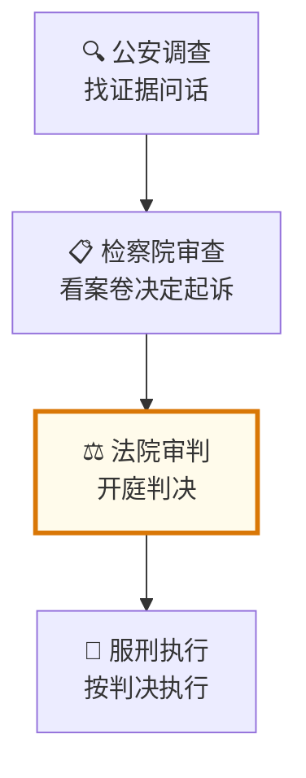

### 2.3 关键校验

- ✅ 节点 ID 全部英文数字：`S1`-`S9`
- ✅ 中文标签用双引号包裹
- ✅ 至少一个 `style` 指令标注当前阶段
- ✅ 节点间用 `-->` 串联（不允许孤立节点）
- ✅ subgraph 中文名用 `"📂 立案阶段"` 半角引号
- ❌ 不允许 `var(--color-xxx)` 出现在 style 中

---

## §3 custody_timeline 羁押时间线

### 🔴 §3 章节顺序（v2.3.1 强制阅读顺序）

> **v2.3.1 关键修复**：LLM 之前在 §3 章节中**先看到 §3.1 短档单图模板就先入为主**，
> 忽略了 §3.0.1 长档双图表架构。**新阅读顺序**严格按"决策→长档→中档→短档"：
>
> ```
> §3.0  三档决策表（首屏，强制读）
> §3.0.1 长档双图表架构（紧跟决策表，最重要）
> §3.0.2 长档 HTML 双容器（v2.3.1 新增，与模板样板对应）
> §3.1  中档单图模板（3-12 月）
> §3.2  短档单图模板（≤ 3 月）
> §3.3  关键校验清单
> §3.4  刑期执行段处理总结
> ```
>
> **禁止顺序**：禁止在 §3.0 决策表之前先给出任何 gantt 模板。

### §3.0 三档决策（v2.3.0 强制 + v3.0.0 强化：section ≤ 2）

> **强制规则**：生成 gantt 前**必须**先判定时间尺度档位，并按档位选择图表架构。
> **判定时机**：Phase 4 步骤 1（预检），早于任何代码生成。

| 档位 | 跨度范围 | 图表架构 | axisFormat | section 上限 | 适用场景 | 视觉宽度预期 |
|------|---------|---------|-----------|-------------|---------|------------|
| **短档** | ≤ 3 个月 | 单 gantt 即可 | `%m-%d` | ≤ 2 | 单一阶段（侦查/审查起诉/一审独立段） | < 800px |
| **中档** | 3-12 个月 | 单 gantt + `excludes weekends` | `%Y-%m` | ≤ 2 | 完整一审流程（立案→判决生效） | 800-1500px |
| **长档** | > 12 个月 | **强制双图表架构（图 A + 图 B）** | 各自独立 | 各 ≤ 2 | 已判决案件（含刑期执行） | 各 < 1000px |

**跨度计算公式**（强制）：

```
span_days = max(任务结束日期) - min(任务开始日期)
span_months = span_days / 30
span_years = span_days / 365

判定：
  span_years <= 1/4 (≈ 3 月)  → 短档
  1/4 < span_years <= 1       → 中档
  span_years > 1              → 长档
```

**长档触发条件**（任一为真即触发）：

1. 输入含"已判决"+"刑期 X 年"或"判决已生效"+"服刑中"
2. 刑期执行段（>12 月）**必须独立**展示
3. 跨度计算 > 365 天

### §3.0.1 长档双图表架构（v2.3.0 新增，v3.0.0 强化：section ≤ 2 + 法条对比表格化）

**问题**：Mermaid gantt 是"小时/天/周"刻度的图。跨度超过 12 个月后，强制措施段（4 段共 192 天）和刑期执行段（10 年 3650 天）物理上无法在同一画布表达——前者刻度挤压、后者画布拉至 3000+px。

**解决**：**强制拆分为 2 个独立 gantt**，包装在同一个 `.chart-block` 内，使用 `.chart-subchart` 容器分隔。

#### 图 A：强制措施时间线（短跨度，约 7 个月）

```mermaid
gantt
    title 图A 强制措施时间线 (2024-03-22 → 2024-10-10, 192天)
    dateFormat YYYY-MM-DD
    axisFormat %m-%d
    excludes    weekends

    section 强制措施阶段（已完结）
    拘留 第91条 ≤37日    :done, s1, 2024-03-22, 37d
    侦查 第156条 ≤2月    :done, s2, 2024-04-28, 48d
    起诉 第172条 ≤1.5月  :done, s3, 2024-06-15, 37d
    审判 第208条 ≤2月    :active, s4, 2024-07-22, 68d

    section 关键节点
    抓获拘留    :milestone, m1, 2024-03-22, 0d
    批准逮捕    :milestone, m2, 2024-04-28, 0d
    侦查终结    :milestone, m3, 2024-06-15, 0d
    提起公诉    :milestone, m4, 2024-07-22, 0d
    一审开庭    :crit, milestone, m5, 2024-09-15, 0d
    一审判决    :crit, milestone, m6, 2024-09-28, 0d
    判决生效    :milestone, m7, 2024-10-10, 0d

    style s4 fill:#fef2f2,stroke:#dc2626,stroke-width:3px,color:#991b1b
    style s1 fill:#dcfce7,stroke:#22c55e
    style s2 fill:#dcfce7,stroke:#22c55e
    style s3 fill:#dcfce7,stroke:#22c55e
    style m5 fill:#dc2626,stroke:#991b1b,color:#ffffff
    style m6 fill:#dc2626,stroke:#991b1b,color:#ffffff
```

#### 图 B：刑期执行时间线（长跨度，约 10 年）

```mermaid
gantt
    title 图B 刑期执行时间线 (2024-03-22 → 2034-03-21, 10年)
    dateFormat YYYY-MM-DD
    axisFormat %Y年%m月

    section 刑期执行
    有期徒刑 10年  :active, p1, 2024-03-22, 3650d

    section 关键节点
    折抵完结      :milestone, p2, 2025-04-04, 0d
    减刑临界 1/2  :milestone, p3, 2029-03-22, 0d
    假释临界 1/2  :milestone, p4, 2029-03-22, 0d
    刑期届满      :crit, milestone, p5, 2034-03-21, 0d

    style p1 fill:#fef2f2,stroke:#dc2626,stroke-width:3px,color:#991b1b
    style p5 fill:#dc2626,stroke:#991b1b,color:#ffffff
    style p2 fill:#fffbeb,stroke:#d97706
    style p3 fill:#dcfce7,stroke:#22c55e
    style p4 fill:#dcfce7,stroke:#22c55e
```

**两个图表必须同时输出**（在同一个 `.chart-block` 内嵌套子标题 `<h5>` 分隔），不能合并为 1 个。

### §3.0.2 长档 HTML 双容器结构（v2.3.1 新增，v3.0.0 更新缩放按钮默认值 + 法条对比表格）

> 本节规定双图表在 HTML 中的**容器结构**。与 `html-template.html` 中的样板
> `LLM_MANDATORY_DEMO_BLOCKS / LONG_CASE_DOUBLE_GANTT` 一一对应。
> **v3.0.0 变更**：缩放按钮默认值从 75%/100% 改为 100%/125%/150%；图A后增加法定期限对比 HTML 表格。

```html
<div class="chart-block">
  <h4 class="chart-title">图2-custody：羁押与刑期时间线（双图表）</h4>
  <p class="chart-desc">图A为强制措施段（短跨度），图B为刑期执行段（长跨度），分开展示避免画布溢出。</p>

  <div class="chart-subchart">
    <h5 class="chart-subchart-title">图A 强制措施时间线（{date1} → {date2}，{N}天）</h5>
    <div class="mermaid-zoom">缩放：<button onclick="zoomMermaid(this, 0.75)">75%</button><button onclick="zoomMermaid(this, 1.0)">100%</button></div>
    <div class="mermaid-wrap">
      <div class="mermaid">
gantt
    title 图A 强制措施时间线
    dateFormat YYYY-MM-DD
    axisFormat %m-%d
    excludes    weekends
    ...（图 A 的 mermaid 代码）
      </div>
      <div class="mermaid-error">图表渲染失败。请展开下方源码区域。</div>
    </div>
  </div>

  <div class="chart-subchart">
    <h5 class="chart-subchart-title">图B 刑期执行时间线（{date1} → {date_end}，{Y}年）</h5>
    <div class="mermaid-zoom">...</div>
    <div class="mermaid-wrap">
      <div class="mermaid">
gantt
    title 图B 刑期执行时间线
    dateFormat YYYY-MM-DD
    axisFormat %Y年%m月
    ...（图 B 的 mermaid 代码）
      </div>
      <div class="mermaid-error">图表渲染失败。请展开下方源码区域。</div>
    </div>
  </div>
</div>
```

### §3.1 中档单图模板（3-12 月）

> **强制**：任务名**不得含** `〔〕（）` 等全角符号。条款引用改为「第91条」纯文字形式。
> **适用**：3-12 月跨度（典型：完整一审流程但无刑期执行段，或未判决但跨度长）

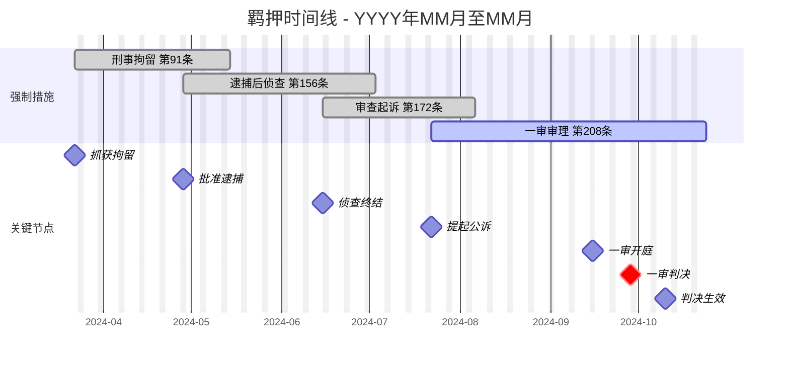

### §3.2 短档单图模板（≤3 月）

> 适用于短期案件（如单一侦查阶段、审查起诉 1.5 月内完成）。

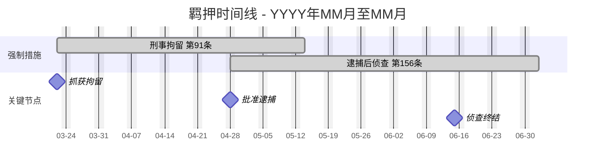

### §3.3 关键校验

- ✅ 任务名 ≤ 12 字符，去除 `〔〕（）`
- ✅ 单 gantt 时间跨度按 §3.0 三档决策：短档单图 / 中档单图+weekends / 长档强制双图表
- ✅ **v3.0.0: section 上限 ≤ 2**（强制措施阶段 + 关键节点，法定期限对比改为 HTML 表格注解）
- ✅ 至少 2 个 `section`
- ✅ 至少 3 个 `milestone` 节点
- ✅ 关键节点用 `:milestone, ...`，当前节点用 `:crit, milestone, ...`
- ❌ **禁止**单 gantt 跨年（长档必须双图）
- ❌ **禁止**gantt section > 2（法条对比不可与进度条在同一 gantt 中重叠）
- ❌ 不允许任务名含小数或特殊符号

### §3.4 刑期执行段处理（v2.3.0 重写）

**❌ 错误理解**：改为 HTML 表格（视觉体验差，不符合顶级法务图标准）
**✅ 正确理解**：拆为双 gantt（图 A 强制措施 + 图 B 刑期执行），详见 §3.0.1

如果案件**没有**刑期执行段（如未判决），仍按短档/中档单 gantt 输出。

### §3.5 法律信息密度准则（v3.0.0 新增）

> **核心原则**：图表是信息传达工具，不是数据转储。信息密度失控 = 图表不可读 = 技能失效。

#### 3.5.1 可视化 vs 表格分工

| 数据类型 | 适合可视化 | 适合 HTML 表格 | 原因 |
|---------|-----------|---------------|------|
| 时间进程（羁押阶段） | ✅ gantt | — | 时间维度天然适合 gantt |
| 法条对比（实际 vs 法定） | ❌ gantt 同层 | ✅ data-table | v2.3.x 证伪：同一 gantt 3 section 重叠不可读 |
| 关键日期节点 | ✅ gantt milestone | — | 单点标注，不占行高 |
| 刑期执行长跨度 | ✅ 独立 gantt | — | 双图表架构 |
| 金额/占比 | ✅ pie | ✅ 配套数据表 | 精度数据放表格 |
| 策略坐标 | ✅ quadrantChart | ✅ 配套中文表 | 双语映射 |

#### 3.5.2 图表复杂度三重检查（Phase 4 新增子步骤）

```
Phase 4 步骤 1.5: 图表复杂度自检
  ↓
Q1: 单图节点/任务数是否超出 §0.5.3 硬上限？
  是 → 拆分图表或降级为表格
  否 → Q2
  ↓
Q2: gantt section 是否 ≤ 2？
  否 → 去除法定期限对比 section，改为 HTML 表格
  是 → Q3
  ↓
Q3: 预估 SVG 尺寸是否满足 §0.5.4 最小值？
  否 → 检查 fontSize/useMaxWidth/barHeight 参数
  是 → 继续生成
```

#### 3.5.3 家属版/律师版图表结构差异

| 图表 | 律师版 | 家属版 |
|------|--------|--------|
| gantt section 数 | ≤ 2（实际进度 + 关键节点） | ≤ 2（实际进度 + 关键日期，通俗措辞） |
| 法条对比 | 配套 HTML 表格（律师版保留条文编号） | 简要文字说明（不标条文编号） |
| 量刑路径 | 分支图+完整法条引用 | 简化路径+"可能范围"+"非预测声明" |

---

## §4 sentencing_path 量刑路径图

### 4.1 律师版结构

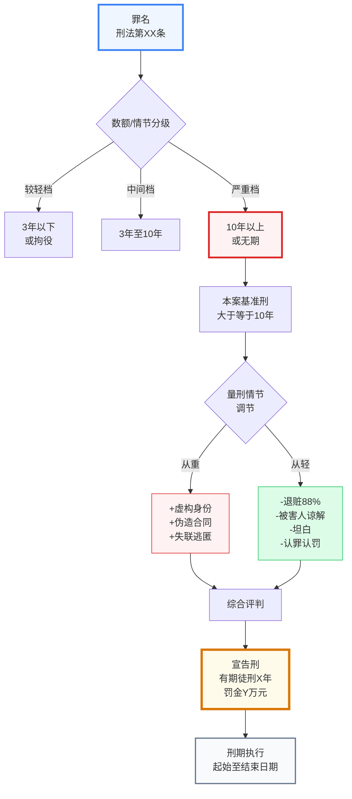

### 4.2 家属版结构（简化版 + 非预测声明）

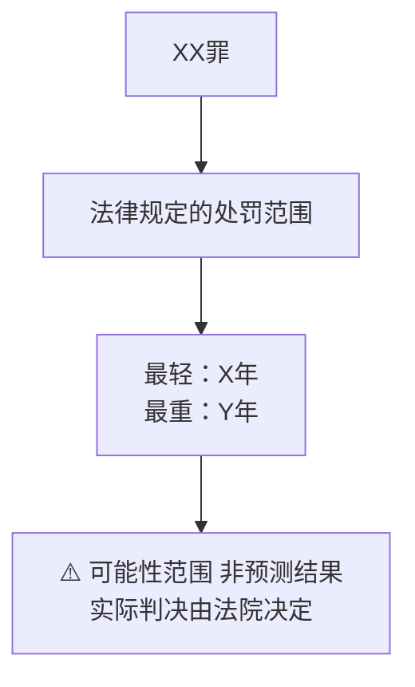

### 4.3 关键校验

- ✅ 节点 ID 全部英文
- ✅ 至少包含"从重"和"从轻"两个分支
- ✅ 末尾必须有"宣告刑"和"非预测声明"
- ✅ 律师版可标注具体年数
- ✅ 家属版**禁止**出现具体年数
- ❌ 不允许使用 `var(--color-xxx)` 引用 CSS 变量

---

## §5 rights_map 当事人权益图

### 5.1 律师版结构

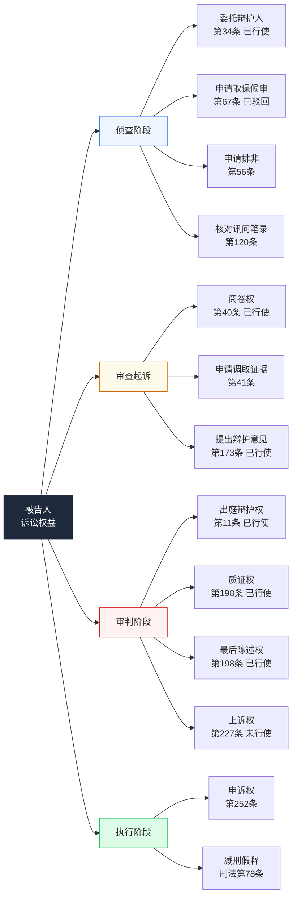

### 5.2 家属版结构

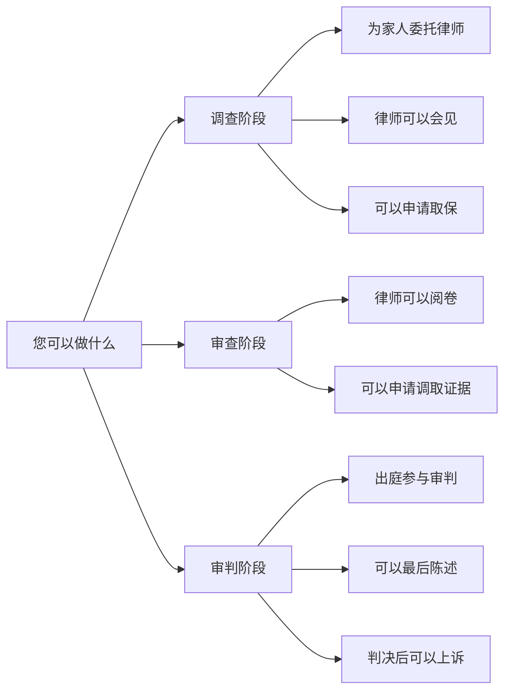

### 5.3 关键校验

- ✅ 4 个主分支（侦查/审查起诉/审判/执行）
- ✅ 每个分支 ≤ 4 个子节点
- ✅ 律师版标注"已行使"/"未行使"
- ✅ 家属版措辞通俗化，无具体条款编号
- ❌ 不使用 `var(--color-xxx)` 引用

---

## §6 defense_matrix 辩护策略矩阵

### 6.0 quadrantChart 完整英中映射表（v2.3.0 强制，v3.0.0 沿用）

> **强制规则**：quadrantChart 的所有标签必须从下表选取，不得自创。

#### 6.0.1 象限名英中映射（4 象限）

| quadrant | 英文（必填） | 中文（配套表用） | 适用 |
|----------|-------------|----------------|------|
| quadrant-1 | `Priority Action` | 优先采用 | 高可行+高影响 |
| quadrant-2 | `Key Breakthrough` | 重点突破 | 低可行+高影响 |
| quadrant-3 | `Auxiliary Argument` | 辅助论证 | 低可行+低影响 |
| quadrant-4 | `Cautious Use` | 谨慎使用 | 高可行+低影响 |

#### 6.0.2 坐标轴标准英文（必填）

| 维度 | 英文 |
|------|------|
| x-axis 高可行 | `High Feasibility` |
| x-axis 低可行 | `Low Feasibility` |
| y-axis 高影响 | `High Impact` |
| y-axis 低影响 | `Low Impact` |

#### 6.0.3 常见辩护策略英文名库（v2.3.0 新增，v3.0.0 沿用）

LLM 生成数据点标签时**必须**从此表选取或按相同英文短语风格命名（`{关键词} + {采纳状态}`），不得使用中文、不得带括号：

| 中文策略 | 英文标签 | 采纳状态后缀 |
|---------|---------|------------|
| 退赃+谅解 | `Refund Plus Understanding` | `Adopted` / `Partial` / `Rejected` / `No Response` |
| 自首 | `Voluntary Surrender` | 同上 |
| 立功 | `Meritorious Service` | 同上 |
| 认罪认罚 | `Plea Bargain` | 同上 |
| 犯罪数额争议 | `Crime Amount Dispute` | 同上 |
| 转化型故意 | `Converted Intent` | 同上 |
| 真实履约 | `Actual Performance` | 同上 |
| 程序违法 | `Procedural Flaw` | 同上 |
| 鉴定意见越权 | `Expert Opinion Overreach` | 同上 |
| 被害人过错 | `Victim Fault` | 同上 |
| 讯问程序瑕疵 | `Interrogation Flaw` | 同上 |
| 证据不足 | `Insufficient Evidence` | 同上 |
| 主观无故意 | `No Criminal Intent` | 同上 |
| 从犯地位 | `Secondary Role` | 同上 |

**完整命名模板**：`"{英文策略名} {采纳状态}"`，例如 `"Refund Plus Understanding Adopted"`、`"Crime Amount Dispute Rejected"`、`"Converted Intent Partial"`。

**禁止命名**：
- ❌ 中文（"退赃88%+谅解(完全采纳)"）
- ❌ 括号补充（`(完全采纳)`）
- ❌ 含数字（"88%"）
- ❌ 含特殊符号（`+`、`&`）

### 6.1 律师版结构

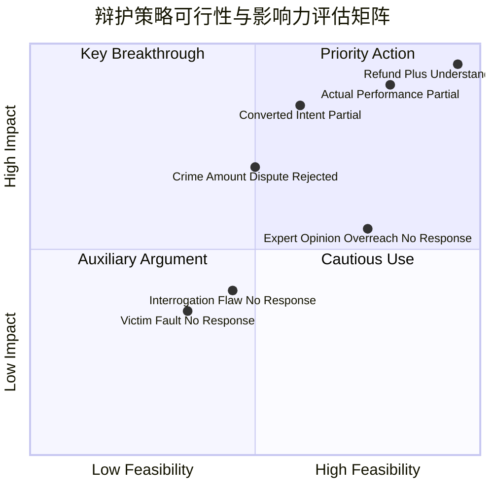

### 6.2 配套中文表格（必须）

| 中文名 | 核心论点 | 法院采纳 | 可行 | 影响 |
|--------|---------|---------|------|------|
| 退赃88%+谅解 | 退赃308万+书面谅解 | ✅ | 95% | 95% |
| 85万真实履约 | 收款后有真实采购 | △ | 80% | 90% |
| 转化型故意 | 经营失败转化 | △ | 60% | 85% |

### 6.3 关键校验

- ✅ quadrant-1/2/3/4 必须英文
- ✅ x-axis / y-axis 必须英文+`-->`箭头
- ✅ 数据点 ≤ 12 个
- ✅ 坐标值 ∈ [0, 1]（如 `0.95, 0.95`）
- ✅ 必须配套中文数据表格
- ❌ 不可用中文 quadrant 标签
- ❌ 不可用中文策略名作为数据点

---

## §7 timeline 案件时间轴

### 7.0 section 标题与标签规则（v2.3.0 强化，v3.0.0 新增 gantt 替代建议）

#### 7.0.1 section 标题硬约束

| 规则 | 错误示例 | 正确示例 |
|------|---------|---------|
| 不得含特殊符号 | `2023年 · 案发` | `2023年案发` |
| 不得含括号 | `2023年(案发)` | `2023年案发` |
| 不得含 emoji | `📅2023年` | `2023年` |
| 长度 ≤ 12 字符 | `2023年案发阶段`（7字） | 同上可接受 |

#### 7.0.2 单条标签硬约束

| 规则 | 说明 |
|------|------|
| 时间标签 ≤ 6 字符 | "5月17日"（4字）✅；"5月17日"+"上午"（7字）❌ |
| 事件描述 ≤ 12 字符 | "拓维公司转账350万"（9字）✅；"经介绍认识陈建国"（8字）✅ |
| 总字符 ≤ 18 | 标签+冒号+事件总长 |
| 不得含 `（）` 全角括号 | 改为破折号"-"或逗号 |
| 不得含 emoji | "🛒购买理财" ❌ |

**超出字符的拆条规则**：
- 时间段类（"6月上旬至7月下旬"）→ 拆为 2 条："6月上旬"+具体事件、"7月下旬"+具体事件
- 事件复合类（"电脑中创建伪造的广州鸿达科技采购合同文件"）→ 简化为"创建伪造合同"

### 7.1 标准结构

> **强制**：单条标签 ≤ 10 字符（汉字计 1 字符）。超出必须拆条或简化。
> **v3.0.0 建议**：Mermaid `timeline` 类型对多事件渲染极不稳定（7 个以上事件 SVG viewBox 极小），如渲染异常请改用 `gantt` 实现时间轴（2 section: 案件事件 + 关键节点）。

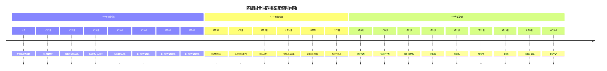

### 7.2 关键校验

- ✅ 时间标签 + 冒号 + 事件描述
- ✅ 单条事件标签 ≤ 10 字符（汉字+数字）
- ✅ section 标题简明（≤ 15 字符）
- ✅ 时间顺序严格升序
- ✅ 总条数 ≤ 25
- ❌ 不允许日期格式混乱（如 "4 月中" 改用 "4月"）

---

## §8 funds_flow 资金流向图

### 8.0 pie 整数化与合并规则（v2.3.0 强化，v3.0.0 沿用）

> **强制规则**：pie 数值必须为整数。小数值按以下规则处理。

#### 8.0.1 整数化规则

| 原值 | 处理动作 | 标签说明 |
|------|---------|---------|
| `13.56` | 圆整为 `14` | 标签内写 "信用卡消费 14 (原 13.56)" |
| `0.5-5.0` | 圆整为 `1-5` | 同上 |
| `< 0.5` | 合并到"其他" | "其他 <0.5" |

#### 8.0.2 类别合并规则（防止过多小类别）

| 条件 | 处理动作 |
|------|---------|
| 圆整后 ≤ 3 且占比 < 5% | **必须**合并到"其他" |
| 圆整后 < 1 | 合并到"其他"（"其他 <1"） |
| 类别总数 > 8 | 按金额降序，剩余小类别合并"其他" |

#### 8.0.3 总和校验

| 检查 | 说明 |
|------|------|
| 圆整后总和 = 原值总和（允许 ±1 误差） | ✅ |
| 配套数据表列出**精确小数和占比** | 强制 |

### 8.1 标准结构

> **强制**：pie 数值**必须为整数**。小数先四舍五入，差异在标签内说明。

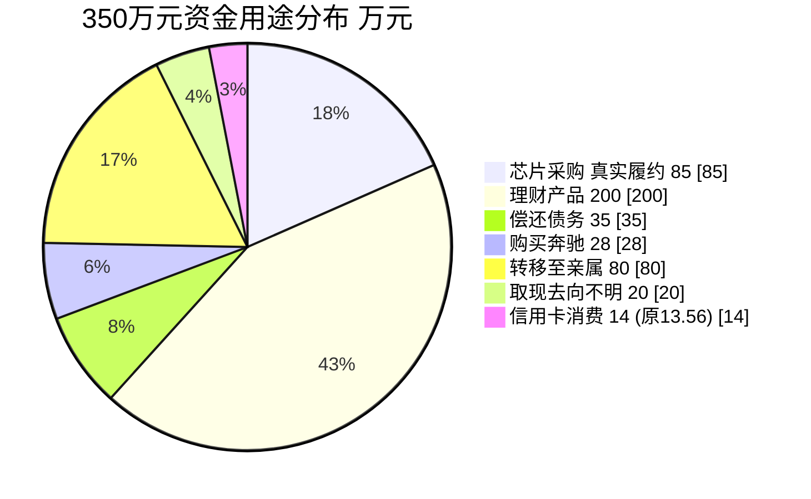

### 8.2 关键校验

- ✅ 数值全部为整数（按 §8.0.1 规则圆整）
- ✅ 类别 ≤ 10 个（按 §8.0.2 规则合并小类别）
- ✅ 标签内可含金额数字说明（"X (原 Y)" 格式）
- ✅ 必须配套数据表（精确小数+占比，按 §8.0.3）
- ❌ 不允许原始小数（`13.56`）直接出现在 pie 数值
- ❌ 不允许用 `~` 或 `约` 等模糊符号在数值处

---

## §9 通用校验规则与失败动作

### 9.1 校验规则（16 条，v3.0.0 扩展 13→16）

| # | 规则 | 校验方式 | 失败动作 |
|---|------|---------|----------|
| 1 | 节点 ID 不含中文/空格/特殊字符 | 正则 `[a-zA-Z0-9_]+` | 替换为英文 ID |
| 2 | 中文标签用半角双引号 `"..."` 包裹 | 检查引号 | 补充引号 |
| 3 | 箭头语法 `-->` 或 `-->\|text\|` | 语法检查 | 修正语法 |
| 4 | style 指令引用已定义节点 ID | ID 匹配 | 移除无效 style |
| 5 | style 颜色值必须实际色值（非 var()） | 正则检查 | 替换为实际色值 |
| 6 | gantt dateFormat 存在 | 关键字检查 | 补充 dateFormat |
| 7 | gantt 任务名不含 `〔〕（）` | 黑名单正则 | 改为「第XX条」 |
| 8 | gantt 时间尺度按 §3.0 三档决策 | 日期差计算 + §3.0 决策表 | 短档单图/中档单图+weekends/长档双图表 |
| 9 | pie 数值必须整数（按 §8.0.1） | 数值检查 | 四舍五入取整 + 标签标注原值 |
| 10 | quadrantChart quadrant 英文（按 §6.0.1） | 正则 `[A-Za-z ]+` | 改为英文 |
| 11 | timeline 单标签 ≤ 10 字符 | 字符数检查 | 简化或拆条 |
| 12 | pie 小类别合并（按 §8.0.2） | 类别数+占比检查 | 合并到"其他" |
| 13 | timeline section 标题无特殊符号 | 黑名单（`·（）📅` 等） | 删除特殊符号 |
| 14 | [v3.0.0] flow/LR/TD 节点数 ≤ 12 | 计数检查 | 拆为多图或降级表格 |
| 15 | [v3.0.0] gantt section 数 ≤ 2 | 计数 `section` 关键字 | 去除法定期限对比 section，改为表格 |
| 16 | [v3.0.0] gantt 单 section 任务+里程碑 ≤ 10 | 计数检查 | 精简或拆 section |

### 9.2 失败动作分级

> **v3.0.0 更新**：分级与 `scripts/mermaid_precheck.py` 一致——block 覆盖 14 条（R1/R3-R10/R12-R16），warning 覆盖 2 条（R2/R11）。

| 失败严重度 | 触发条件 | 动作 |
|-----------|---------|------|
| **block** | R1/R3-R10/R12-R16 任一 | 自动修复（如不能修复）→ DEGRADED-L2 阻断交付 |
| **warning** | R2 中文标签未引号 / R11 标签超长 | 自动简化 + 警告标注（不阻断） |
| **info** | 颜色色值未用变量化 | 继续生成，记录到优化清单 |

### 9.3 渲染失败降级路径

```
图表 Mermaid 渲染失败
  ↓
触发 mermaid.parseError 回调
  ↓
激活 .mermaid-error.visible 显示错误信息
  ↓
LLM 读取错误信息
  ↓
尝试自动修复（去 var()、去特殊符号、改英文）
  ↓
若修复失败 → 输出源数据表格 + 文字描述
  ↓
标注 "图表渲染失败，仅展示源数据"
```

### 9.4 配套源数据表强制规则

> 每个图表**必须**配套 `<table class="data-table">` 源数据表。即使图表成功渲染，数据表也是降级备选。

| 图表 | 必备数据表 |
|------|-----------|
| case_flow | 阶段+日期+羁押天数+法条 |
| custody_timeline | 阶段+起止+天数+法定期限+超期判断 |
| sentencing_path | 档位+数额区间+对应刑期+本案档位 |
| rights_map | 权利+条款+是否已行使+行使证据 |
| defense_matrix | 策略+论点+采纳情况+可行性+影响力 |
| timeline | 完整时间事件列表 |
| funds_flow | 资金用途+金额+占比+性质 |
