# 反面教材示例：Mermaid 语法错误集合

## 用途

> 本示例汇集 criminal-case-visualization v2.1.0 → v2.3.0 之间实际产物的 10 类典型 Mermaid 渲染错误，每个错误配 `错误示例` + `正确示例` + `失败原因`。
>
> **强制学习要求**：执行本技能的所有 LLM 在生成 Mermaid 代码前**必须**完整阅读本文件，避免重蹈覆辙。

---

## 错误 #1：流程图节点过多导致拉长

### 错误示例

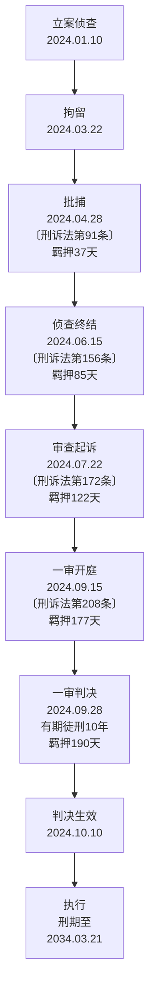

### 失败现象

- 9 节点全部竖向排列，画布高度 3000+px
- 节点大小参差不齐（"立案侦查"矮，"批捕"/"侦查终结"超长）
- 浏览器视口只能看到 1/3 图表
- 移动端完全不可读

### 正确示例（v2.2.0 规范）

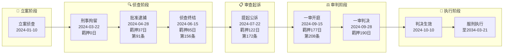

### 修复要点

1. `graph TD` → `graph LR`（横向布局）
2. 增加 5 个 `subgraph` 分段
3. 节点 ID 改为英文 `S1`-`S9`
4. 条款引用 `〔刑诉法第91条〕` → `第91条`（去除全角中括号）

---

## 错误 #2：Gantt 任务名含特殊字符

### 错误示例

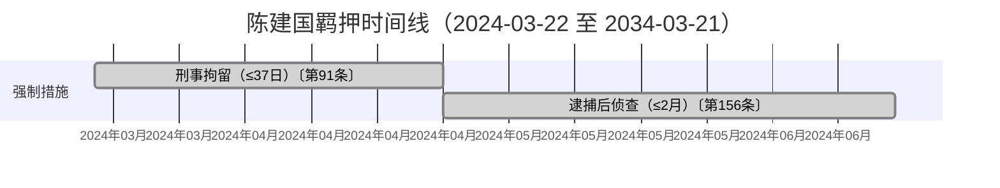

### 失败现象

- 任务条变成灰色矩形无内容
- 关键节点（milestone）变成无标注菱形
- 部分版本直接抛 `Syntax error in text`
- 时间轴 10 年跨度（2024-2034）导致刻度挤压无法辨认

### 正确示例

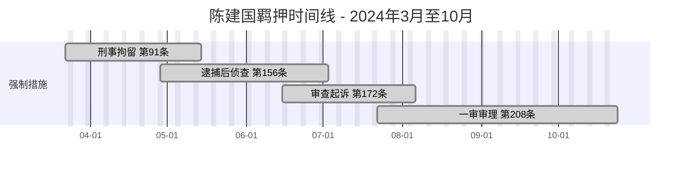

### 修复要点

1. 任务名 `〔第91条〕` → `第91条`（去除全角中括号）
2. 任务名 `(≤37日)` → 直接删除（信息密度高+视觉简洁）
3. 标题日期 `（2024-03-22 至 2034-03-21）` → `- 2024年3月至10月`（缩短跨度）
4. axisFormat `%Y年%m月` → `%m-%d`（仅月日）
5. 刑期执行段移出图表（避免 10 年跨度）
6. 增加 `excludes weekends` 提升可读性

---

## 错误 #3：style 指令使用 CSS 变量

### 错误示例

```mermaid
%% ❌ 错误：Mermaid 不支持 CSS 变量
graph TD
    A[起点] --> B[终点]
    style A fill:var(--color-primary-light),stroke:var(--color-primary-medium)
    style B fill:var(--color-danger-light),stroke:var(--color-danger-medium)
```

### 失败现象

- 整个图表渲染失败或部分节点无样式
- 浏览器控制台报 `Parse error on line X`
- 不同浏览器表现不一致

### 正确示例

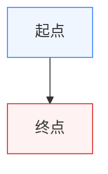

### 色值映射表（常用）

| 语义 | 实际色值 |
|------|---------|
| 主色-淡 | `#eff6ff` |
| 主色-中 | `#3b82f6` |
| 主色-深 | `#1e3a8a` |
| 强调-绿 | `#22c55e` / `#dcfce7` |
| 警告-琥珀 | `#d97706` / `#fffbeb` |
| 危险-红 | `#dc2626` / `#fef2f2` |
| 信息-灰 | `#64748b` / `#f8fafc` |

完整映射表见 `chart-specifications.md` §0.2。

---

## 错误 #4：quadrantChart 中文象限标签

### 错误示例

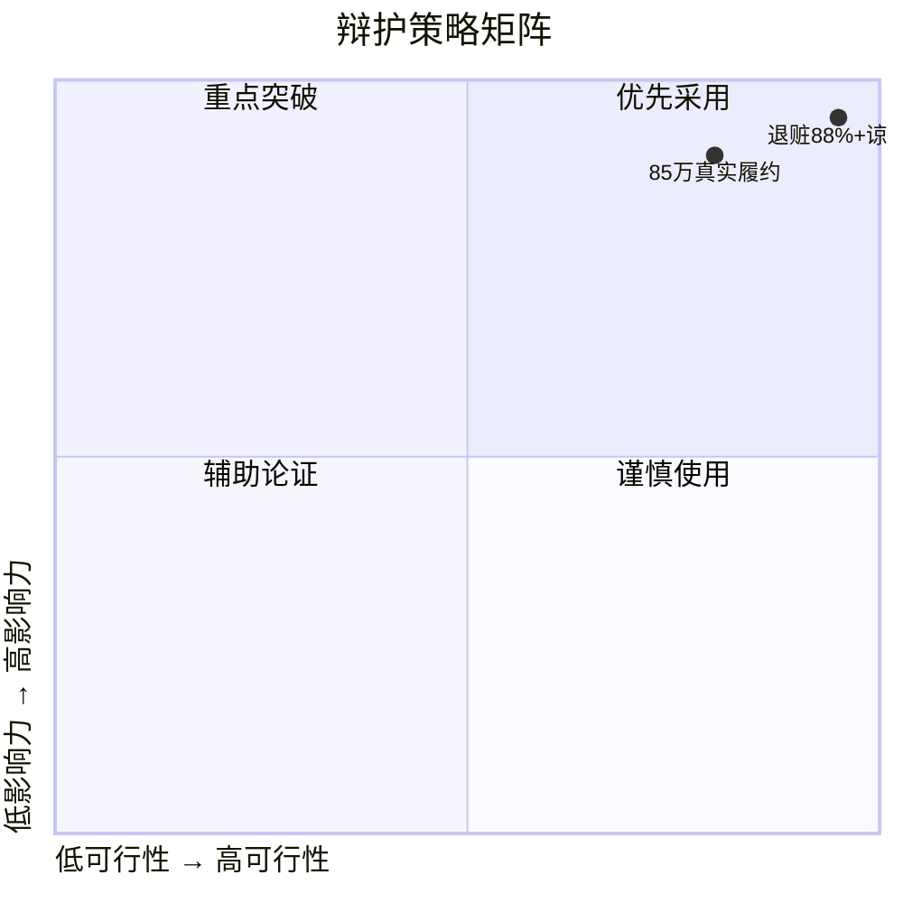

### 失败现象

- quadrant 标签不显示或显示为乱码
- 数据点无法定位到象限
- 部分版本直接渲染失败

### 正确示例

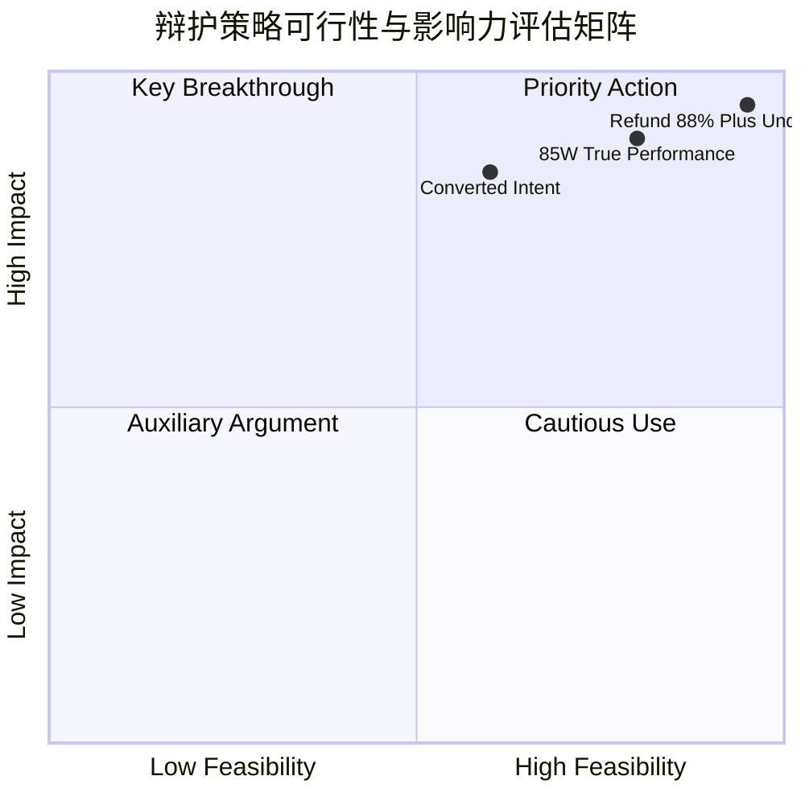

### 配套中文数据表（必须）

| 中文名 | 核心论点 | 法院采纳 | 可行 | 影响 |
|--------|---------|---------|------|------|
| 退赃88%+谅解 | 退赃308万+书面谅解 | ✅ | 95% | 95% |
| 85万真实履约 | 收款后有真实采购 | △ | 80% | 90% |
| 转化型故意 | 经营失败转化 | △ | 60% | 85% |

---

## 错误 #5：pie 数值含小数

### 错误示例

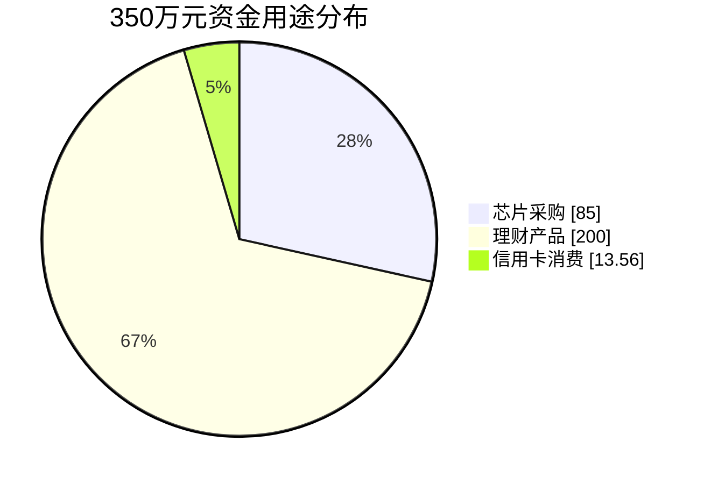

### 失败现象

- 图表渲染失败
- 部分版本四舍五入但标签错位
- 报错 `pie value should be an integer`

### 正确示例

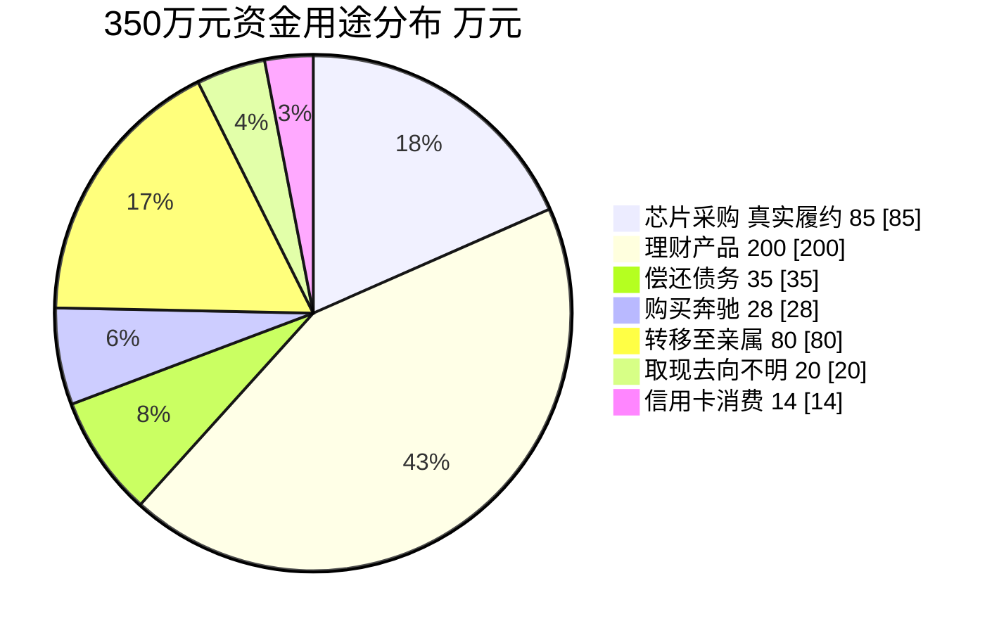

### 修复要点

1. `13.56` → `14`（四舍五入）
2. 标签内说明"14（原 13.56）"或保留原始数字在小数位
3. 配套数据表给出精确小数和占比

---

## 错误 #6：timeline 标签过长

### 错误示例

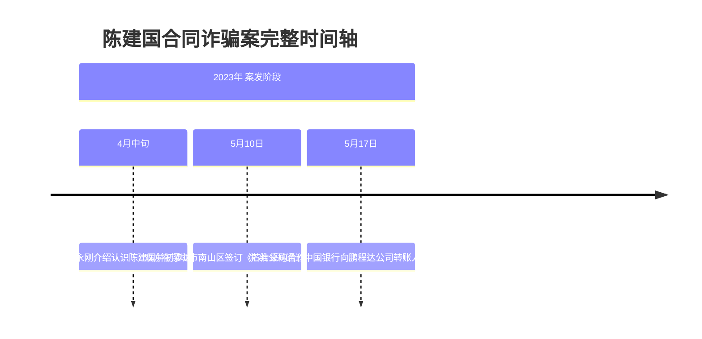

### 失败现象

- 标签自动换行错位
- section 标题与时间标签重叠
- 长标签被截断显示为 "..."

### 正确示例

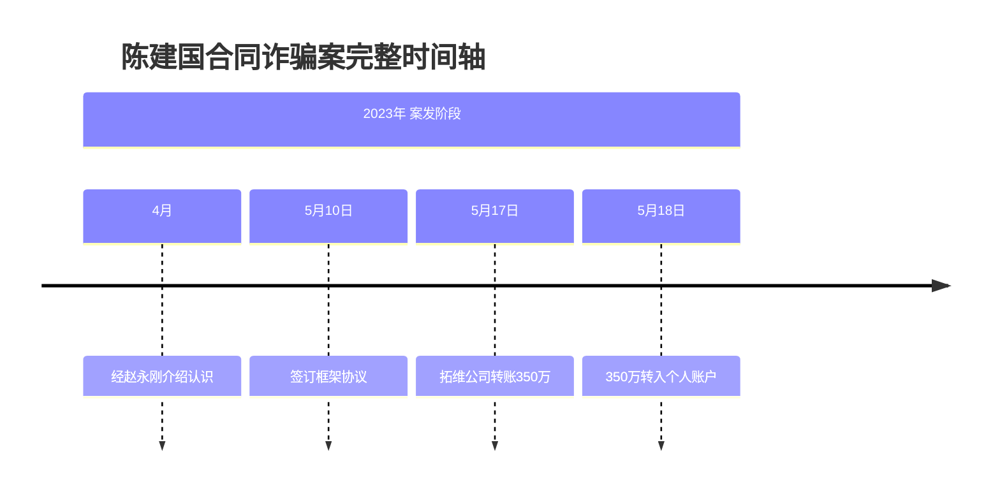

### 修复要点

1. 标签"张明辉经赵永刚介绍认识陈建国并初步达成合作意向" → 简化为"经赵永刚介绍认识"
2. 详细描述放入配套分析区（`<div class="analysis-block">`）
3. 数字金额可保留（如"转账350万"）

---

## 错误 #7：节点 ID 含中文/特殊字符

### 错误示例

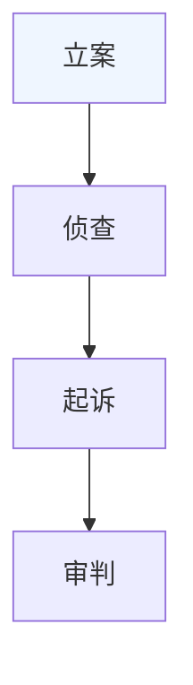

### 失败现象

- 不同 Mermaid 版本表现不一致
- 部分版本渲染失败
- style 指令无法引用含中文 ID

### 正确示例

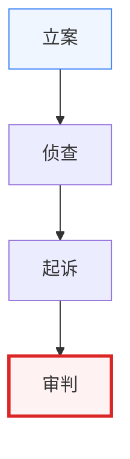

### ID 命名规范

| 图表 | 模式 | 示例 | 数量上限 |
|------|------|------|---------|
| 流程图 | `S1`, `S2`, ... | `S1`, `S9` | 20 |
| 决策 | `J1`, `J2`, ... | `J1`(数额) | 10 |
| 分支 | `A1`, `B1`, `C1`, `D1` | `B1`(侦查分支) | 每分支 6 |
| Gantt 任务 | `a1`, `a2`, ... | `a1`(拘留) | 15 |
| Gantt 里程碑 | `m1`, `m2`, ... | `m1`(抓获) | 10 |

---

## 快速自检清单（生成 Mermaid 前必检）

```
[ ] 节点 ID 全部英文+数字
[ ] 中文标签用 "..." 包裹
[ ] style 指令颜色全部实际色值（非 var()）
[ ] Gantt 任务名不含 〔〕（） 等特殊符号
[ ] Gantt 时间跨度按档位决策（≤3月单图/3-12月单图+weekends/>12月双图表）
[ ] pie 数值全部整数
[ ] quadrantChart 标签全部英文
[ ] timeline 单标签 ≤ 10 字符
[ ] 流程图节点 ≥6 时用 LR 布局
[ ] 每个图表配套源数据表格
```

---

## 错误恢复机制

如果 Mermaid 渲染失败，自动按以下顺序恢复：

1. **激活 `.mermaid-error.visible` 元素**，显示错误信息
2. **调用 `mermaid.parseError` 回调**，记录到控制台
3. **降级输出源数据表格**（即使图表失败，表格仍可读）
4. **LLM 读取错误并自动修复**（应用本文件规则）
5. **重新渲染**：若仍失败 → 输出文字描述+警告

---

## 错误 #8：gantt 单图跨年（v2.3.0 新增）

### 错误示例

> 案情：2024-03-22 抓获 → 2024-09-28 判决 → 2024-10-10 生效 → 刑期 10 年至 2034-03-21

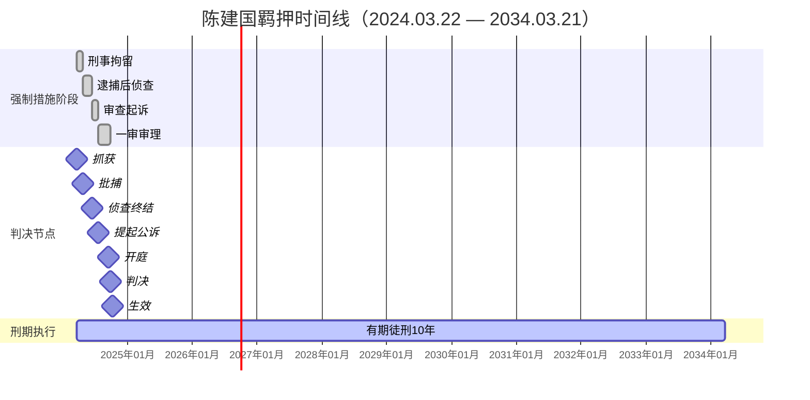

### 失败现象

- 10 年跨度 + 14 任务/里程碑堆叠在 200px 高画布
- 时间刻度挤压成单字符
- 任务条与里程碑相互遮挡
- 7 个里程碑变为无标注菱形
- Mermaid 渲染抛 `Syntax error in text`（部分版本）或画布溢出

### 正确示例：双图表架构

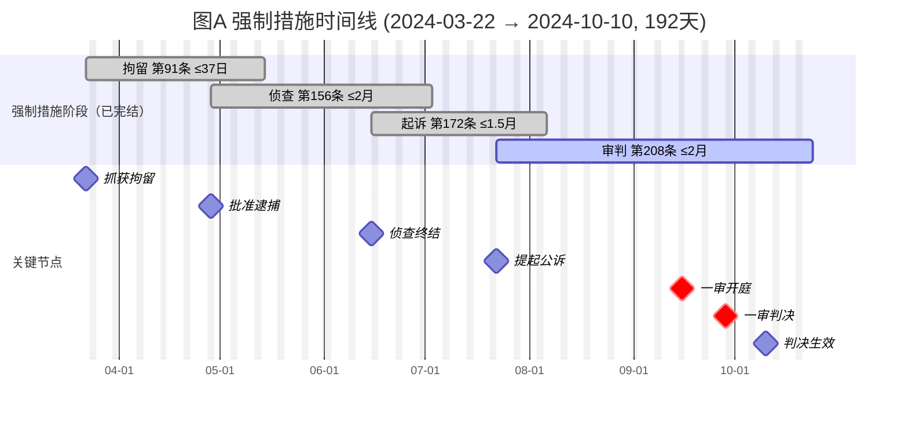

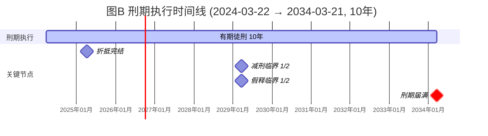

### 修复要点

1. 单 gantt 跨度 > 12 个月 → **强制拆分**为 2 个独立 gantt
2. 图 A 强制措施段（短跨度）→ axisFormat `%m-%d` + `excludes weekends`
3. 图 B 刑期执行段（长跨度）→ axisFormat `%Y年%m月` + 仅 1 任务+4 里程碑
4. 两个图表必须同时输出，在同一 `.chart-block` 内嵌套 `<h5>` 子标题分隔
5. 当前阶段任务条用 `style ... fill:#fef2f2,stroke:#dc2626` 红色填充

---

## 错误 #9：pie 多类别小数无合并规则（v2.3.0 新增）

### 错误示例

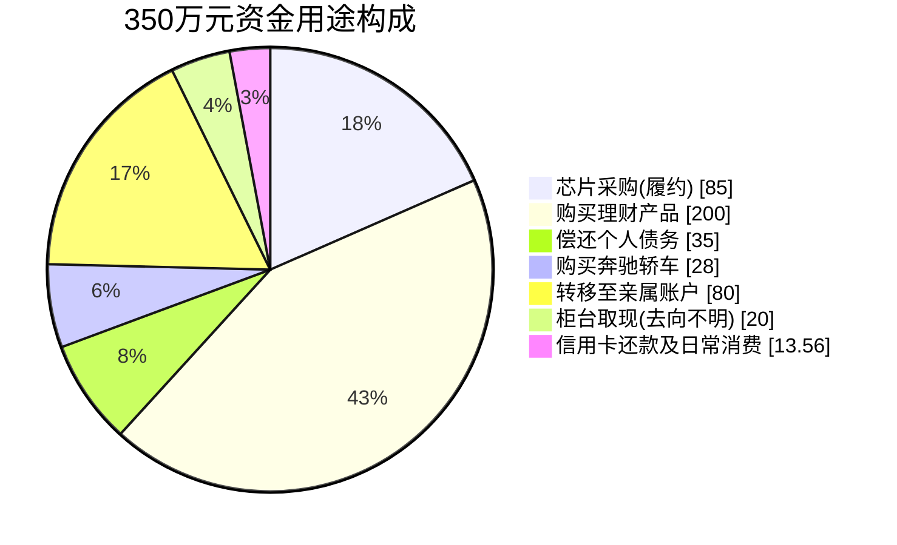

### 失败现象

- Mermaid 抛 `pie value should be an integer`
- 标签"柜台取现(去向不明)"含全角括号
- 7 个类别，13.56 类别圆整后占比 < 5%

### 正确示例

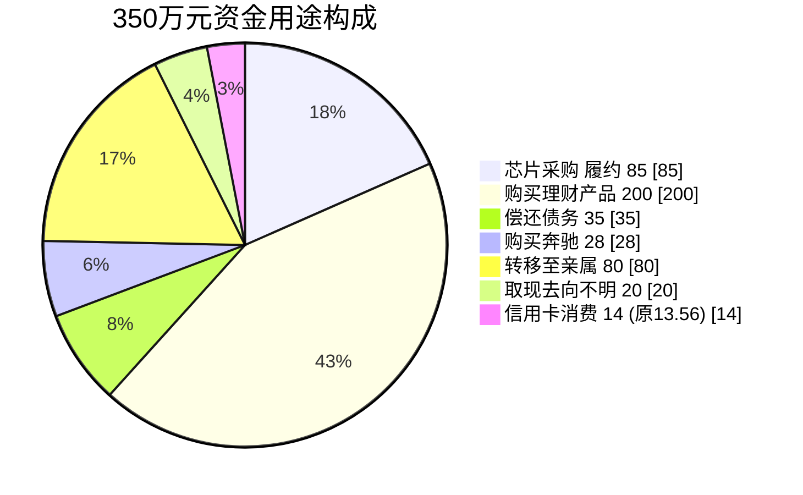

### 修复要点

1. `13.56` → `14`（四舍五入），标签内写"14 (原 13.56)"保留精度
2. 若圆整后 < 1 或占比 < 5% → 合并到"其他"类别
3. 类别总数 ≤ 8（超 8 需按金额降序合并小类）
4. 配套 `<table class="data-table">` 列出精确小数和占比

---

## 错误 #10：quadrantChart 中文数据点标签（v2.3.0 新增）

### 错误示例

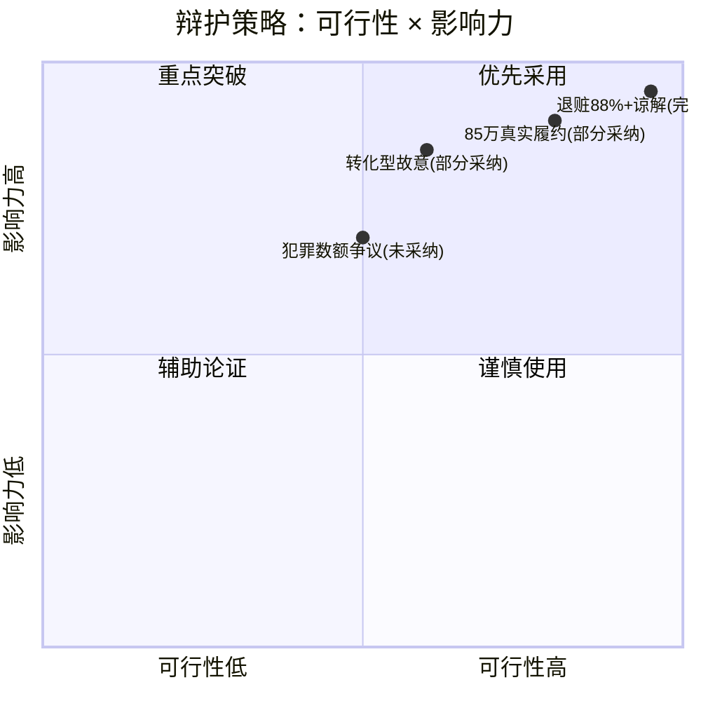

### 失败现象

- quadrant 标签不显示或乱码
- 数据点含 `+`、`(`、`数字` 触发解析
- 渲染失败或部分节点丢失

### 正确示例：英中映射

```mermaid
%% ✅ 正确：quadrant 英文 + 数据点英文命名
quadrantChart
    title 辩护策略: Feasibility x Impact
    x-axis Low Feasibility --> High Feasibility
    y-axis Low Impact --> High Impact
    quadrant-1 Priority Action
    quadrant-2 Key Breakthrough
    quadrant-3 Auxiliary Argument
    quadrant-4 Cautious Use
    "Refund Plus Understanding Adopted": [0.95, 0.95]
    "Actual Performance Partial": [0.80, 0.90]
    "Converted Intent Partial": [0.60, 0.85]
    "Crime Amount Dispute Rejected": [0.50, 0.70]
```

### 配套中文数据表（必须）

| 中文策略 | 核心论点 | 法院回应 | 可行 | 影响 |
|---------|---------|---------|------|------|
| 退赃88%+谅解 | 退赃308万+书面谅解 | ✅ 完全采纳 | 95% | 95% |
| 85万真实履约 | 收款后有真实采购 | △ 部分采纳 | 80% | 90% |
| 转化型故意 | 经营失败转化 | △ 部分采纳 | 60% | 85% |
| 犯罪数额争议 | 主张以265万为基准 | ❌ 未采纳 | 50% | 70% |

### 修复要点

1. quadrant-1/2/3/4 → 英文固定映射（Priority Action/Key Breakthrough/Auxiliary Argument/Cautious Use）
2. 数据点命名模板：`"{英文策略名} {采纳状态}"`，如 `"Refund Plus Understanding Adopted"`
3. 常见策略英文名库见 `chart-specifications.md` §6.0.3
4. 配套中文表格承载完整中文信息和法院回应

---

**记住**：Mermaid 渲染失败不是终点，源数据表格是兜底。**任何 Mermaid 代码生成后必须经过本文件清单检查才能写入产物。**
