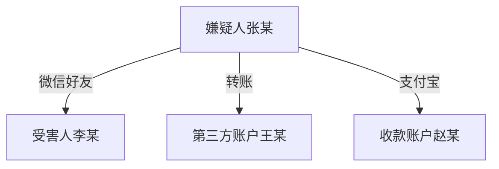

# 刑事电子证据分析 — 输出规格

> 本节遵循 compiler/ssot.md §17（SSOT）：视觉输出标准契约
>
> **HTML排版规范引用声明**：
> - HTML排版遵照 `base/rule/format-html/format/html-spec.md` §2.2 I-Practical + §3.3 方案C
> - HTML详细排版规范见 `references/html-format-spec.md`
> - 组件引用 `base/rule/format-html/components/` c04-evidence-catalog / c05-risk-list
> - Mermaid图表遵照 `base/rule/format-html/format/mermaid-spec.md`

## 格式能力声明

```yaml
format_capabilities:
  - format: markdown
    supports: [internal_review, email_text, copy_paste]
  - format: html
    supports: [print, pdf_export, browser_view]

default_output:
  o1:
    format: markdown
    format_seriousness: I-Practical
  o2:
    format: markdown
    format_seriousness: I-Practical
```

## §0.5 写作红线

> 本技能遵守 `base/shared/writing-redlines.md` 全部 11 条通用红线（WR-01~WR-11），以下为行业特定红线和补充项。

### 6.1 行业特定红线（前3条为最高优先级）

| # | 红线 | 说明 | 违反后果 |
|---|------|------|---------|
| **R-1** | **禁止法条编号错误** | 引用法条必须经检索验证，编号错误是法律AI的"原罪"——引用错误的法条编号比不引用还糟糕 | 🔴阻断级——律师在法庭引用错误法条直接损害专业形象 |
| **R-2** | **禁止"设备=人"直接等同** | 设备在场≠人在场，设备使用≠本人操作，须独立论证主体同一性 | 🔴阻断级——跳过主体同一性论证等于放弃核心辩护权 |
| **R-3** | **禁止"瑕疵=非法"混淆** | 第27条瑕疵（可补正）≠第28条非法（不得作为定案根据），严格区分审查 | 🔴阻断级——混淆法律后果严重，可能导致辩护方向错误 |
| R-4 | 规范性质区分 | "可以"（授权性）≠"应当"（命令性），论证中必须正确匹配 | 逻辑错误导致论证失效 |
| R-5 | 概念区分 | 完整性校验值≠数字签名；电子数据≠电子证据（后者是法律概念）；原始性≠真实性（前者可客观校验，后者需主观判断） | 术语混用损害专业可信度 |
| R-6 | 自相矛盾禁止 | 完整性评估与瑕疵结论须一致；辩护点与风险等级须呼应 | 矛盾输出丧失参考价值 |
| R-7 | 反面论证要求 | 不仅分析"电子数据证明了什么"，也分析"电子数据未能证明什么" | 单面分析遗漏辩护空间 |
| R-8 | 去分析化 | 正式输出中禁止"【分析】""【结论】"等框架标签 | 标签外泄显得不专业 |
| R-9 | 技术术语严格区分 | 哈希值/校验值/数字签名/数字证书各有明确法律和技术含义，禁止混用 | 术语混用导致法律判断偏差 |
| R-10 | 哈希值通过≠数据真实 | 哈希值一致只能证明数据在两个校验时间点之间未被修改，不能证明数据内容本身是真实的 | 混淆可能导致过度信赖 |
| R-11 | 排除申请审慎表述 | 禁止直接断言"该证据系非法证据"，应使用"该证据取证程序存在XX瑕疵，依据2016规定第27/28条，提请法庭审查其证据能力" | 断言式表述可能被视为律师主观判断而非基于事实的质疑 |
| R-12 | 完整性校验值≠数字签名 | 特别强调：完整性校验值只能证明数据未被修改，数字签名还能证明签署者身份，两者法律效力不同 | 效力混同影响质证策略 |

### 6.2 通用红线补充声明

| 通用红线编号 | 本技能补充说明 |
|------------|--------------|
| WR-01 不使用绝对化表述 | 补充：禁止"数据必然真实""该证据一定无效"等表述 |
| WR-02 结论留边界 | 补充：所有哈希值校验结论须加"在当前校验值范围内"限定 |
| WR-05 法条引用须标注来源 | 强化：电子数据法规体系复杂（刑诉法+2016规定+2019规则+2021解释+数据安全法），引用时必须标明法规简称和条文号，避免跨法规混淆 |
| WR-07 不编造法条或判例 | 强化：不确定哈希值校验算法或取证工具是否合规时标注"[需核实]"，绝不编造 |
| WR-11 文书结构风格统一 | 适用：本技能输出为分析报告（非文书起草），但报告结构须统一——12维度框架为唯一结构，禁止混搭其他分析框架 |

### 6.3 LLM常见违规专项

> 基于历史评测发现的LLM生成常见问题，作为自动防御清单

| # | 违规类型 | 表现 | 检测方法 | 严重度 |
|---|---------|------|---------|--------|
| LLM-1 | **编造法条编号** | 引用不存在的法条条文号（如"2016规定第30条"——该规定仅29条） | 交叉验证legal-references.md法条范围 | 🔴P0 |
| LLM-2 | **跨法规条文混淆** | 把2021刑诉法解释第93条（证人证言）内容写为电子数据审查条文 | 比对法条内容与条文主题 | 🔴P0 |
| LLM-3 | **哈希值过度解读** | "哈希值一致→数据真实""无哈希值→证据无效" | 搜索"哈希值.*真实""无哈希值.*无效" | 🔴P0 |
| LLM-4 | **设备=人直接等同** | "该IP地址为嫌疑人使用的IP，因此该操作系嫌疑人本人实施" | 搜索"IP地址.*本人实施""设备.*嫌疑人操作" | 🔴P0 |
| LLM-5 | **瑕疵→非法跳跃** | "取证程序存在瑕疵，该证据不得作为定案根据"——跳过了第27条补正可能性 | 搜索"瑕疵.*不得作为定案根据" | 🔴P0 |
| LLM-6 | **原始性=真实性等同** | "原始性存疑，因此数据不真实"——原始性影响真实性但两者非等号 | 搜索"原始性.*不真实""原始.*数据虚假" | 🟡P1 |
| LLM-7 | **排除断言过度** | "该证据系非法证据，应当予以排除"——应由律师判断，AI不应断言 | 搜索"非法证据.*应当排除""应当.*排除" | 🟡P1 |
| LLM-8 | **时间戳未校时区** | 直接使用UTC时间戳按北京时间重建时间线 | 检查时间线是否有时区换算说明 | 🟡P1 |
| LLM-9 | **截图=原始数据** | 把微信截图当作原始电子数据分析，未区分传来证据 | 搜索"截图.*原始""微信截图.*电子数据" | 🟡P1 |
| LLM-10 | **镜像=逻辑提取混淆** | "从镜像中提取"但未区分物理镜像vs逻辑提取 | 搜索"镜像.*提取"但无"物理/逻辑"区分说明 | ⚪P2 |

## 1. 主要输出块（5件套）

### O1：电子证据解构清单（Markdown表格）

| 列 | 字段 | 说明 |
|----|------|------|
| 1 | 证据编号 | E01, E02, ... |
| 2 | 证据名称 | 原始名称 |
| 3 | 载体类型 | 手机/电脑/服务器/云端/U盘等 |
| 4 | 收集方式 | 扣押/现场提取/在线提取/远程勘验/调取 |
| 5 | 完整性状态 | 完整/待验证/存疑/缺失 |
| 6 | 哈希值 | MD5/SHA-1/SHA-256 值或"未提供" |
| 7 | 关键内容 | 一句话摘要 |
| 8 | 主体映射 | 网络身份→现实身份的映射状态 |
| 9 | 时间戳 | 最早-最晚时间范围 |
| 10 | 辩护可用点 | 该证据的C组维度核心发现 |
| 11 | 风险等级 | **高**/**中**/**低** |

### O2：12维度评估报告（Markdown）

标准结构：
```
## A组：证据基础维度（能不能用）
### A1 载体识别
- 评估结论：[合规/存疑/不合规]
- 事实依据：[具体描述]
- 风险等级：**高**/**中**/**低**
- 应对建议：[具体可操作建议]

### A2 完整性核验
[同上结构，逐维度展开A2-A4]

## B组：内容解构维度（说了什么）
### B5 主体同一性
[同上结构，逐维度展开B5-B8]

## C组：辩护点发现维度（对辩方有什么用）
### C9 客观性挑战点
[同上结构，逐维度展开C9-C12]
```

### O3：主体-行为-资金三维映射

#### 3.1 人物关系图（Mermaid）



#### 3.2 时间线重建

按时间戳排列的关键事件序列，标注证据来源。

#### 3.3 资金流分析

资金流转路径，标注金额、时间、账户。

### O4：可执行下游动作清单（Markdown表格）

| 列 | 字段 | 说明 |
|----|------|------|
| 1 | 动作类型 | 质证/排除/调取/重新鉴定 |
| 2 | 涉及证据 | 证据编号 |
| 3 | 具体建议 | 含法条依据的操作建议 |
| 4 | 下游技能参考 | 弱引用（如"类似质证提纲可参考criminal-cross-examination"） |
| 5 | 优先级 | P0/P1/P2 |

### O5：可视化HTML报告

将O1-O4组装为完整HTML报告，浏览器打开即看。采用I-Practical+方案C现代轻量风格。

**排版参数**（遵照 `html-format-spec.md` §1-§3）：

| 参数 | 值 | 来源 |
|------|-----|------|
| 严肃度 | I-Practical | 内部产物 |
| 视觉方案 | C-现代轻量（青灰 #005f73 + 暖橙 #EE9B00） | html-spec.md §3.3 |
| @page margin | 2.0cm 1.5cm 1.5cm 3.0cm | I-Practical 标准 |
| body font | 微软雅黑, 11pt | I-Practical 标准 |
| line-height | 1.6（屏幕）/ 1.8（打印） | 增强可读性 |
| 允许元素 | Emoji风险标记 / 可折叠区域 / 信息卡片 / 侧栏导航 | html-spec.md §19 |

**模板**：`templates/html/html-template.html`（HARD_BLOCK/CONTENT_SLOT模式）

## 2. 条件输出块

| # | 输出块 | 触发条件 | 内容范围 |
|---|--------|---------|---------|
| C1 | 鉴定意见专项审查 | 存在forensic_report输入 | 鉴定资质/程序/方法/结论范围四要素审查 |
| C2 | 罪名专攻审查提示 | crime_type ∈ {T1,T2,T3,T4,T5} | 该罪名特有的审查重点和常见辩护点 |
| C3 | 删除恢复分析 | 证据含"已删除数据恢复" | 恢复方法的可靠性/完整性/是否经合法程序 |

## 3. 编号体系

| 层级 | 格式 | 用途 | 示例 |
|------|------|------|------|
| 证据编号 | E+两位数字 | 电子证据条目 | E01, E02 |
| 维度编号 | A1-A4/B5-B8/C9-C12 | 12维度评估 | A2, B5, C11 |
| 动作编号 | A+三位数字 | 下游动作条目 | A001, A002 |
| 时间线事件 | T+三位数字 | 时间线节点 | T001, T002 |

## 4. 引用规则

| 引用类型 | 格式规范 | 示例 |
|---------|---------|------|
| 法律条文 | 《法规简称》第X条 | 《刑事诉讼法》第50条 |
| 电子数据规定 | 2016规定第X条 | 2016规定第28条 |
| 取证规则 | 2019规则第X条 | 2019规则第11条 |
| 内部交叉引用 | [见O1-E01] | 证据清单中的E01号证据 |
| 证据引用 | E01 | 编号引用 |

## 5. 不产出清单

| # | 不产出的内容 | 理由 |
|---|------------|------|
| 1 | 确定性胜诉把握 | 违反L3致命禁止#1 |
| 2 | 质证提纲全文 | 属于criminal-cross-examination技能 |
| 3 | 非法证据排除申请书 | 属于criminal-evidence-exclusion技能 |
| 4 | 调取证据申请书 | 属于criminal-evidence-request技能 |
| 5 | 司法鉴定意见 | 本技能审查鉴定意见，不出具鉴定意见 |
| 6 | 通用证据三性分析 | 属于criminal-evidence-analysis技能 |
| 7 | 具体辩护策略 | 供分析参考，辩护策略由律师独立判断 |


